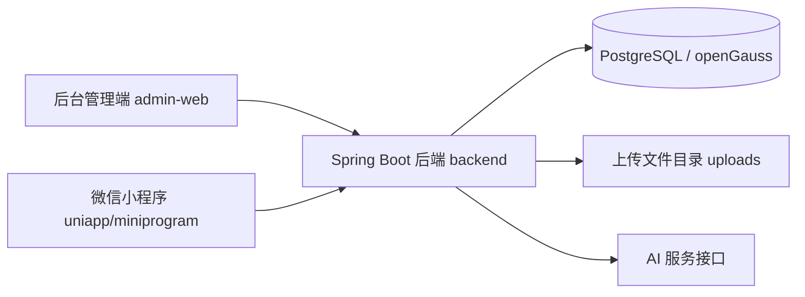
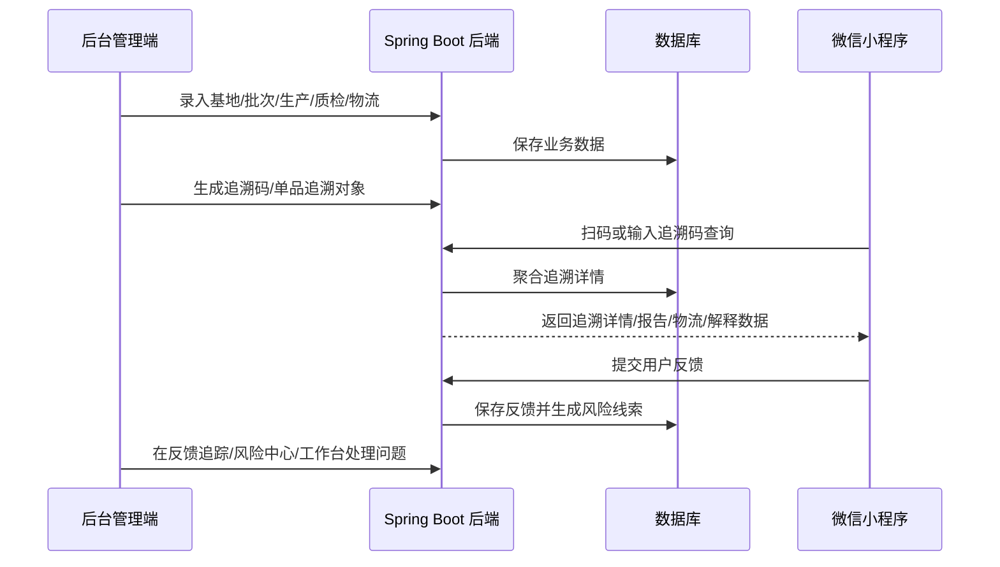
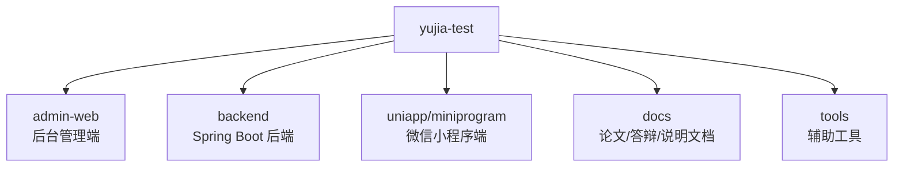
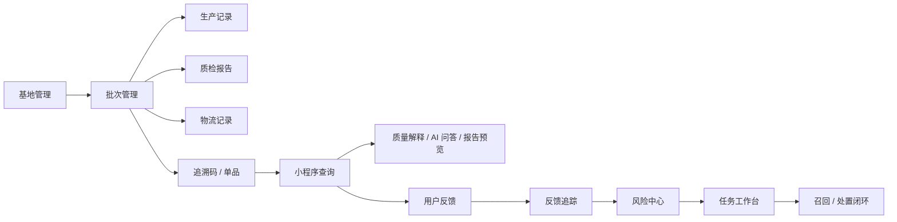
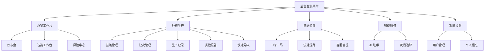
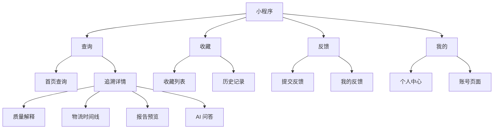
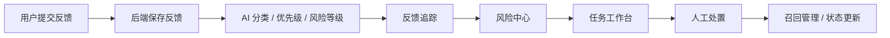
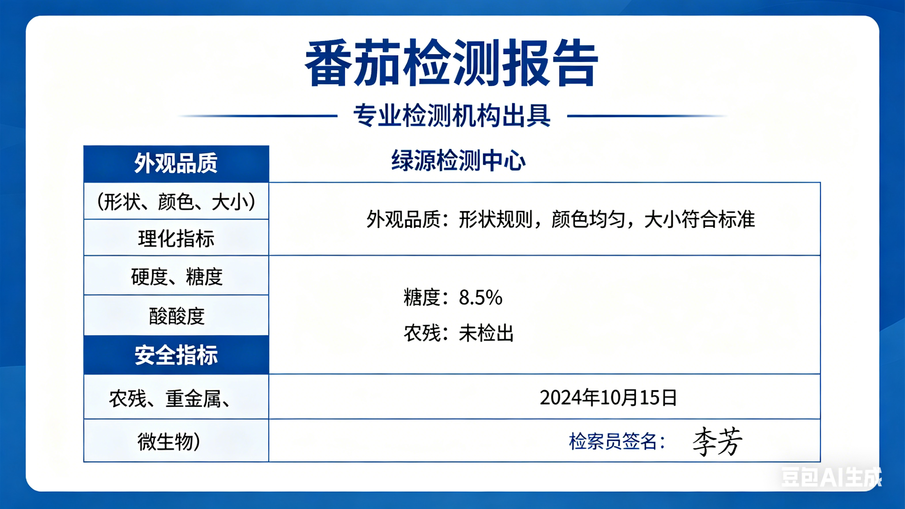

# yujia农产品溯源系统总说明文档

## 1. 项目概述

`yujia农产品溯源系统` 是一个面向农产品质量追溯、信息公开展示、风险回流处理与业务协同管理的完整系统。项目采用“后台管理端 + Spring Boot 后端 + 微信小程序端”的多端协同架构，围绕农产品从基地、批次、生产、质检、物流到召回、反馈、风险处置的全链路业务展开。

本系统不是单纯的“二维码查询页面”，而是一个完整的农产品追溯平台，核心目标包括：

1. 帮助企业完成农产品追溯档案的后台建档与维护。
2. 帮助消费者通过扫码或输入追溯码快速查询产品来源与流转信息。
3. 在发现异常、风险或用户投诉后，将问题从用户端回流至后台，形成可跟踪、可处理、可闭环的风险协同机制。
4. 通过 AI 辅助分类、AI 问答与风险中心，提高信息解释能力和处理效率。

一句话概括本系统：

“企业先建档，消费者再查询，问题再回流，后台再闭环处理。”

### 系统总体示意图



---

## 2. 系统定位与业务价值

### 2.1 解决的问题

本系统主要解决以下几类实际问题：

1. 农产品生产与流通过程中的数据分散问题。
2. 消费者对产品来源、生产过程、质检结果、物流链路缺乏透明认知的问题。
3. 出现质量风险、召回事件或用户投诉后，企业缺乏统一跟踪与协同处理平台的问题。
4. 普通用户“看得见数据但看不懂数据”的问题。

### 2.2 适用场景

本系统适用于以下场景：

1. 农业企业、合作社、种植基地的溯源建档与管理。
2. 农产品出厂后的批次追踪、物流追踪与质量证明公开。
3. 基于二维码的一物一码或批次码公开查询。
4. 用户扫码后的反馈回收与风险预警。
5. 毕业设计、课程设计、答辩演示中的“多端协同信息系统”展示。

### 2.3 系统亮点

本项目的亮点不只在于“能查”，而在于“查得全、看得懂、能回流、能闭环”：

1. 有完整业务主线：基地 -> 批次 -> 生产记录 -> 质检报告 -> 物流记录 -> 追溯码 -> 查询 -> 反馈 -> 风险 -> 任务。
2. 支持多端协同：管理端负责维护，小程序端负责公开查询与反馈。
3. 支持企业数据隔离：不同企业的数据按 `companyId` 进行范围约束。
4. 支持追溯码签名校验：避免追溯参数被随意篡改。
5. 支持质量解释、AI 问答与 AI 反馈分类：增强可理解性与可处理性。
6. 支持反馈追踪、风险中心、任务工作台：形成业务闭环。

---

## 3. 系统整体架构

### 3.1 架构组成

本仓库由三大子系统组成：

1. `backend`
   Spring Boot 后端，负责核心业务、数据访问、认证鉴权、文件上传、追溯详情聚合、风险处理与 AI 能力接入。

2. `admin-web`
   基于 Vue 3 + Vite + Element Plus 的后台管理端，面向企业员工或管理员，负责业务数据录入、维护、查询和处置。

3. `uniapp/miniprogram`
   微信小程序端，面向消费者或普通用户，负责扫码查询、追溯详情展示、质量解释、物流时间线、AI 问答、收藏与反馈。

### 3.2 总体技术路线

系统采用前后端分离架构：

1. 后端统一提供 REST 风格接口。
2. 管理端与小程序端分别调用后端接口。
3. 业务核心逻辑集中在后端服务层。
4. 数据统一存储在 PostgreSQL / openGauss 兼容数据库中。

### 3.3 多端协同关系

系统的典型协同过程如下：

1. 企业人员在后台管理端录入基地、批次、生产、质检、物流等信息。
2. 后端生成追溯码或单品追溯对象，并提供公开查询能力。
3. 用户在微信小程序中扫码或输入追溯码查询详情。
4. 小程序展示追溯详情、质量解释、物流时间线、报告预览等内容。
5. 用户如发现异常，可提交反馈。
6. 反馈在后台进入反馈追踪、风险中心、任务工作台。
7. 后台管理人员根据风险等级、优先级和状态完成处置。

### 多端协同流程图



---

## 4. 技术栈说明

### 4.1 后端技术栈

`backend` 主要技术栈如下：

1. Java 17
2. Spring Boot 3.5.13
3. Spring Web
4. Spring Validation
5. MyBatis Spring Boot Starter 3.0.4
6. PostgreSQL JDBC 42.5.1
7. Lombok
8. Maven Wrapper

后端主要负责：

1. 登录注册与身份认证
2. 用户、角色、企业范围控制
3. 基础数据管理
4. 追溯详情聚合
5. 文件上传与静态访问
6. 风险与任务协同
7. AI 反馈分类与 AI 问答能力接入

### 4.2 管理端技术栈

`admin-web` 主要技术栈如下：

1. Vue 3
2. TypeScript
3. Vite
4. Vue Router
5. Pinia
6. Axios
7. Element Plus
8. `qrcode.vue`

管理端主要负责：

1. 后台登录与权限进入
2. 仪表盘展示
3. 各类基础业务数据录入与维护
4. 反馈与风险处置页面
5. 智能工作台与 AI 助手
6. 用户与个人信息维护

### 4.3 小程序端技术栈

`uniapp/miniprogram` 当前以微信原生小程序目录结构为主，配合 TypeScript 类型定义文件开发，主要使用：

1. 微信小程序原生页面机制
2. TypeScript
3. 微信小程序 API
4. 本地缓存能力

小程序端主要负责：

1. 追溯码查询入口
2. 追溯详情展示
3. 质量解释页面
4. 物流时间线页面
5. 报告预览
6. AI 问答
7. 收藏与历史
8. 用户反馈与我的反馈

### 4.4 数据库

当前后端配置使用 PostgreSQL 驱动，连接地址配置为：

`jdbc:postgresql://localhost:15432/yujia_db`

从项目文档与整体设计来看，系统兼容 openGauss 生态，适合作为毕业设计中的数据库选型说明。仓库内也保留了多份手工 SQL 升级脚本，用于增量补充新功能。

---

## 5. 项目目录结构

项目根目录主要结构如下：

```text
yujia-test/
├─ admin-web/                 后台管理端
├─ backend/                   Spring Boot 后端
│  ├─ sql/manual/             手工执行的增量 SQL 脚本
│  ├─ src/main/java/          Java 源码
│  ├─ src/main/resources/     配置与 Mapper
│  └─ uploads/                上传文件目录
├─ docs/                      答辩、说明书、论文等文档
├─ tools/                     辅助工具目录
├─ uniapp/                    微信小程序相关工程
│  └─ miniprogram/            小程序页面与逻辑
└─ README.md                  当前总说明文档
```

### 项目目录结构图



### 5.1 `backend` 目录说明

`backend` 是整个系统的业务中台，目录重点如下：

1. `src/main/java/com/yujia/backend/controller`
   控制器层，对外暴露接口。

2. `src/main/java/com/yujia/backend/service`
   业务逻辑层，封装业务规则、聚合逻辑和流程处理。

3. `src/main/java/com/yujia/backend/mapper`
   MyBatis Mapper 接口层。

4. `src/main/resources/mapper`
   SQL 映射文件。

5. `src/main/resources/application.yml`
   后端核心配置文件。

6. `sql/manual`
   手工执行的数据库升级 SQL，例如智能能力升级、任务操作追踪、企业隔离等脚本。

7. `uploads`
   上传文件存储目录，例如质检报告附件、物流附件等。

### 5.2 `admin-web` 目录说明

`admin-web` 是管理端前端工程，重点目录如下：

1. `src/router`
   路由配置与路由守卫。

2. `src/layouts`
   页面布局，当前后台使用统一管理布局。

3. `src/views`
   各业务页面。

4. `src/api`
   API 请求封装。

5. `src/stores`
   Pinia 状态管理，当前主要用于认证信息维护。

6. `src/styles`
   全局样式与 Element Plus 主题覆盖。

### 5.3 `uniapp/miniprogram` 目录说明

小程序核心目录如下：

1. `pages/index`
   首页查询入口。

2. `pages/trace-detail`
   追溯详情页面。

3. `pages/quality-interpretation`
   质量解释页面。

4. `pages/logistics-timeline`
   物流时间线页面。

5. `pages/report-preview`
   报告预览页面。

6. `pages/ai-qa`
   AI 问答页面。

7. `pages/collection`
   收藏页面。

8. `pages/history`
   查询历史页面。

9. `pages/feedback`
   反馈提交页面。

10. `pages/my-feedback`
    我的反馈页面。

11. `pages/profile` / `pages/account`
    用户个人中心与账号相关页面。

12. `services`
    小程序端接口调用封装。

13. `types`
    类型定义。

14. `utils`
    格式化与工具函数。

---

## 6. 核心业务主线

本系统的业务主线建议按以下顺序理解：

1. 企业建立基础档案。
2. 企业创建产品批次。
3. 企业补充生产记录、质检报告、物流记录等链路信息。
4. 系统生成追溯码或单品追溯对象。
5. 用户扫码或输入追溯码查询。
6. 系统向用户展示聚合后的追溯详情。
7. 用户可进行质量解释查看、物流查看、AI 问答、收藏、反馈。
8. 反馈进入后台，由风险中心与任务工作台处理。

### 6.1 为什么“批次”是核心

在实际业务中，很多追溯事件天然以“批次”为中心：

1. 生产记录通常围绕某一批次展开。
2. 质检报告通常对应某一批次。
3. 物流记录可按批次或单品展开。
4. 召回通常也是批次级事件。
5. 用户扫码反馈的问题也常常可以回溯到具体批次。

因此，批次是系统最自然、最稳定的业务主线中心。

### 核心业务主线图



---

## 7. 后端模块详细说明

根据当前 `controller` 目录，后端已经包含较完整的业务模块。

### 7.1 认证与用户模块

相关控制器包括：

1. `AuthController`
2. `SysUserController`
3. `SysRoleController`
4. `CompanyController`

这一部分主要负责：

1. 用户注册
2. 用户登录
3. 当前用户信息查询
4. 用户列表与用户管理
5. 角色与权限信息
6. 企业信息及企业范围隔离

认证机制上，前端通过 Bearer Token 携带身份凭证，后端根据当前用户加载用户信息和企业范围。

### 7.2 基础业务档案模块

相关控制器包括：

1. `BaseInfoController`
2. `ProductBatchController`
3. `ProductionRecordController`
4. `InspectionReportController`
5. `LogisticsRecordController`
6. `ProductItemController`
7. `CropInfoImportController`

这一部分用于维护追溯基础档案：

1. 基地信息
2. 批次信息
3. 生产操作记录
4. 质检报告
5. 物流链路记录
6. 单品信息或一物一码对象
7. 快速导入作物信息

### 7.3 追溯查询与公开展示模块

相关控制器包括：

1. `TraceCodeController`
2. `FileController`
3. `HealthController`

这一部分主要负责：

1. 生成或管理追溯码对象
2. 根据追溯码查询追溯详情
3. 校验签名，防止追溯参数被篡改
4. 提供报告、附件等文件访问能力
5. 提供系统健康检查能力

### 7.4 仪表盘与风控模块

相关控制器包括：

1. `DashboardController`
2. `RiskController`
3. `RecallRecordController`
4. `SystemTaskController`
5. `FeedbackController`

这一部分主要负责：

1. 仪表盘统计概览
2. 风险中心聚合
3. 召回记录管理
4. 系统任务分派与状态推进
5. 用户反馈管理与跟踪

### 7.5 AI 能力模块

相关控制器包括：

1. `AiChatController`

相关服务从当前仓库可以看出包括：

1. `AiChatService`
2. `AiRateLimitService`
3. `FeedbackAiClassifierService`

这一部分用于：

1. 小程序端或管理端的 AI 问答
2. 反馈内容的智能分类
3. 风险等级、优先级、分类标签的辅助生成
4. AI 请求限流

当前配置文件显示 AI 接口默认与 `DeepSeek` 风格配置兼容，支持通过环境变量注入：

1. `DEEPSEEK_API_KEY`
2. `DEEPSEEK_BASE_URL`
3. `DEEPSEEK_MODEL`
4. `DEEPSEEK_ENABLED`

---

## 8. 管理端模块详细说明

管理端页面主要位于 `admin-web/src/views`。结合当前路由配置，系统包含以下主要页面模块。

### 8.1 公共页面

1. `LoginView.vue`
   登录页面。

2. `RegisterView.vue`
   注册页面。

### 8.2 总览工作台模块

当前菜单已调整为二级结构，模块包括：

1. `DashboardView.vue`
   仪表盘，用于展示整体概览数据。

2. `TaskWorkbenchView.vue`
   智能工作台，用于查看待处理事项、任务状态与协同处理入口。

3. `RiskCenterView.vue`
   风险中心，用于聚合展示高风险批次、反馈异常、扫描异常等重点问题。

### 8.3 种植生产模块

1. `BaseListView.vue`
   基地管理。

2. `BatchListView.vue`
   批次管理。

3. `BatchArchiveView.vue`
   批次档案详情页，适合答辩展示“聚合能力”。

4. `ProductionRecordView.vue`
   生产记录管理。

5. `InspectionReportView.vue`
   质检报告管理。

6. `CropQuickImportView.vue`
   快速导入作物信息。

### 8.4 流通追溯模块

1. `ProductItemView.vue`
   一物一码 / 单品管理。

2. `LogisticsView.vue`
   物流链路管理。

3. `RecallView.vue`
   召回管理。

### 8.5 智能服务模块

1. `StaffAiAssistantView.vue`
   后台 AI 助手页面。

2. `FeedbackTrackView.vue`
   反馈追踪页面。

### 8.6 系统设置模块

1. `UserListView.vue`
   用户管理。

2. `ProfileView.vue`
   个人信息页。

### 8.7 菜单结构说明

目前后台左侧菜单已按“模块 + 子菜单”的二级结构组织，目的包括：

1. 减少一级菜单数量过多的问题。
2. 提高页面结构清晰度。
3. 更符合后台系统常见的信息架构设计。
4. 便于答辩时按模块展示业务。

当前分组包括：

1. 总览工作台
2. 种植生产
3. 流通追溯
4. 智能服务
5. 系统设置

### 管理端菜单结构图



---

## 9. 小程序端模块详细说明

根据 `uniapp/miniprogram/app.json` 当前页面配置，小程序主要包含以下页面。

### 9.1 首页查询

页面：`pages/index/index`

功能：

1. 手动输入追溯码
2. 扫码查询
3. 跳转到追溯详情页

这是用户进入系统的主要入口。

### 9.2 追溯详情

页面：`pages/trace-detail/index`

功能：

1. 展示验真结果
2. 展示基地信息
3. 展示批次信息
4. 展示生产记录
5. 展示质检报告
6. 展示物流信息
7. 展示召回状态

这是系统最核心的对外展示页面。

### 9.3 质量解释

页面：`pages/quality-interpretation/index`

功能：

1. 根据追溯详情生成质量解释文本
2. 展示可信度评分
3. 展示亮点与风险提示
4. 给出面向用户的理解建议

该页面的价值在于把原始数据转化为普通用户更易理解的信息。

### 9.4 物流时间线

页面：`pages/logistics-timeline/index`

功能：

1. 按时间顺序展示物流节点
2. 体现产品流转轨迹
3. 对用户更直观地展示运输过程

### 9.5 报告预览

页面：`pages/report-preview/index`

功能：

1. 打开质检报告附件
2. 预览图片或文档

### 9.6 AI 问答

页面：`pages/ai-qa/index`

功能：

1. 基于当前商品追溯信息发起提问
2. 获得 AI 返回的解释结果
3. 结合当前商品的公开信息进行回答

### 9.7 收藏与历史

页面包括：

1. `pages/collection/index`
2. `pages/history/index`

功能：

1. 收藏常看的追溯对象
2. 保存查询历史
3. 提升重复查询体验

### 9.8 反馈与我的反馈

页面包括：

1. `pages/feedback/index`
2. `pages/my-feedback/index`

功能：

1. 提交问题反馈
2. 填写反馈内容和联系方式
3. 在“我的反馈”中查看状态

### 9.9 个人中心相关

页面包括：

1. `pages/profile/index`
2. `pages/account/index`

功能：

1. 用户中心展示
2. 账号相关信息操作

### 9.10 底部 Tab 栏

当前小程序底部 Tab 栏包括：

1. 查询
2. 收藏
3. 反馈
4. 我的

这一设计符合“查询为主、反馈回流、个人记录沉淀”的使用逻辑。

### 小程序页面结构图



---

## 10. 数据流说明

### 10.1 后台建档数据流

后台建档的典型流程：

1. 创建企业或在企业范围内登录。
2. 创建基地信息。
3. 创建产品批次。
4. 为批次补充生产记录。
5. 为批次补充质检报告。
6. 为批次补充物流记录。
7. 生成追溯码或单品对象。

### 10.2 用户查询数据流

用户查询的典型流程：

1. 用户扫码或输入追溯码。
2. 小程序解析出 `traceId` 等参数。
3. 后端校验签名有效性。
4. 后端按批次或单品聚合多表信息。
5. 后端返回统一追溯详情对象。
6. 小程序展示详情、解释、物流、报告等内容。

### 10.3 风险回流数据流

风险回流的典型流程：

1. 用户提交反馈。
2. 后端保存反馈内容。
3. AI 对反馈进行分类、优先级与风险等级辅助判断。
4. 反馈进入后台反馈追踪页面。
5. 风险中心聚合显示高风险信息。
6. 工作台以任务形式推进处理。
7. 如有必要，可触发召回处理。

### 风险回流闭环图



---

## 11. 安全与权限设计

### 11.1 登录与认证

系统采用登录后获取 Token 的方式进行身份认证。

基本流程如下：

1. 用户在管理端登录。
2. 后端验证用户名与密码。
3. 后端返回 Token。
4. 前端在后续请求头中携带 `Authorization: Bearer ...`。

### 11.2 路由与页面访问控制

管理端通过路由守卫控制访问：

1. 公共页面如登录、注册无需登录。
2. 非公共页面必须存在登录态。
3. 未登录会跳转回登录页。
4. 非员工身份不能进入后台页面。
5. 特定页面可以继续扩展 `adminOnly` 等权限限制。

### 11.3 企业数据范围隔离

从当前仓库中的 SQL 与服务命名可以看出，系统已经考虑企业隔离能力。其目的在于：

1. 不同企业用户只能看到自己企业的数据。
2. 防止跨企业数据误读、误改、误查。
3. 让系统具备多企业场景的扩展基础。

### 11.4 追溯码签名校验

系统并不是只依赖一个明文追溯参数，而是结合追溯关键字段生成签名值，在查询时重新计算并校验。

这样做的目的：

1. 防止二维码参数被手工篡改。
2. 保证查询结果与真实追溯对象一致。
3. 让追溯链路具有基本的验真能力。

---

## 12. AI 能力设计说明

### 12.1 AI 反馈分类

系统中的 AI 不只是装饰性功能，而是服务于实际业务处理。

当前配置与代码结构显示，AI 可以对用户反馈进行：

1. 分类
2. 优先级判断
3. 风险等级判断
4. 处理建议摘要生成

例如可区分为：

1. 质量类
2. 物流类
3. 服务类
4. 其他类

这能帮助后台更快判断“先处理什么、哪种问题更危险”。

### 12.2 AI 问答

AI 问答主要服务于用户端和后台辅助理解：

1. 用户可围绕当前商品追溯详情发问。
2. 系统根据当前追溯数据组织上下文。
3. AI 回答应尽量围绕已有事实进行解释，而不是脱离数据自由发挥。

### 12.3 AI 配置项

后端 `application.yml` 当前与以下环境变量兼容：

1. `DEEPSEEK_ENABLED`
2. `DEEPSEEK_API_KEY`
3. `DEEPSEEK_BASE_URL`
4. `DEEPSEEK_MODEL`
5. `DEEPSEEK_TEMPERATURE`
6. `DEEPSEEK_CONNECT_TIMEOUT_MS`
7. `DEEPSEEK_READ_TIMEOUT_MS`
8. `DEEPSEEK_STAFF_LIMIT_PER_MINUTE`
9. `DEEPSEEK_USER_LIMIT_PER_MINUTE`

### 12.4 使用建议

如果本地没有配置 AI Key，系统中的 AI 相关能力可能无法完整工作。建议：

1. 在演示前确认 `.env` 或系统环境变量已配置。
2. 如果答辩现场网络不稳定，提前准备非 AI 路径的功能演示。
3. README、论文和答辩中将 AI 描述为“辅助解释与辅助分类能力”，会更稳妥。

---

## 13. 数据库与 SQL 脚本说明

### 13.1 当前数据库连接配置

后端配置文件当前默认值如下：

1. 端口：`8080`
2. 数据库地址：`localhost:15432`
3. 数据库名：`yujia_db`
4. 用户名：`yujia`
5. 密码：`YuJia@123456`

如果你更换了本地数据库环境，需要同步修改：

文件：`backend/src/main/resources/application.yml`

### 13.2 SQL 脚本目录

当前仓库存在以下手工 SQL 脚本：

1. `backend/sql/manual/2026-05-06-intelligence-upgrade.sql`
2. `backend/sql/manual/2026-05-06-task-operation-tracking.sql`
3. `backend/sql/manual/2026-05-08-company-isolation.sql`

这些脚本通常用于：

1. 新增智能能力相关字段
2. 增加任务操作追踪能力
3. 增加企业范围隔离能力

### 13.3 建议的数据库准备顺序

如果重新部署项目，建议按以下思路准备数据库：

1. 先导入系统基础表结构。
2. 再执行后续增量 SQL。
3. 再准备测试数据或演示数据。
4. 最后启动前后端联调。

如果你的基础建表 SQL 不在仓库中，建议后续单独补充一个 `docs/database` 或 `backend/sql/init` 目录，用于保存完整初始化脚本。

---

## 14. 本地开发环境要求

建议本地开发环境如下：

### 14.1 后端环境

1. JDK 17
2. Maven 或直接使用项目自带 `mvnw.cmd`
3. PostgreSQL 或 openGauss 兼容环境

### 14.2 管理端环境

1. Node.js 18 及以上
2. npm

### 14.3 小程序环境

1. 微信开发者工具
2. 小程序项目导入能力
3. 本地可访问后端接口

---

## 15. 本地运行指南

下面给出推荐的本地运行方式。

### 15.1 启动后端

进入目录：

```powershell
cd backend
```

使用 Maven Wrapper 启动：

```powershell
.\mvnw.cmd spring-boot:run
```

如果只是先验证能否编译通过，可以执行：

```powershell
.\mvnw.cmd -q -DskipTests compile
```

后端默认访问地址：

`http://localhost:8080`

### 15.2 启动管理端

进入目录：

```powershell
cd admin-web
```

安装依赖：

```powershell
npm install
```

启动开发服务器：

```powershell
npm run dev
```

构建生产包：

```powershell
npm run build
```

### 15.3 启动小程序端

小程序端通常不是通过命令行启动，而是通过微信开发者工具导入项目目录：

`uniapp`

或按你当前工程组织方式导入：

`uniapp/miniprogram`

建议检查：

1. 小程序请求域名或本地调试域名配置。
2. 后端接口地址是否已修改为本机可访问地址。
3. 需要登录或用户信息时，是否已准备好测试账号。

### 15.4 推荐启动顺序

建议按以下顺序启动：

1. 启动数据库
2. 启动后端
3. 启动管理端
4. 打开小程序开发工具

---

## 16. 管理端使用说明

### 16.1 登录

先进入管理端登录页，使用员工或管理员账号登录系统。

登录后可进行：

1. 仪表盘查看
2. 基地和批次建档
3. 生产、质检、物流维护
4. 一物一码维护
5. 反馈与风险处理

### 16.2 推荐录入顺序

建议按以下顺序录入演示数据：

1. 基地管理
2. 批次管理
3. 生产记录
4. 质检报告
5. 物流记录
6. 单品或追溯码
7. 召回信息

### 16.3 推荐展示顺序

答辩或演示时建议顺序如下：

1. 仪表盘
2. 基地管理
3. 批次管理
4. 批次档案
5. 生产记录
6. 质检报告
7. 物流记录
8. 一物一码
9. 反馈追踪
10. 风险中心
11. 智能工作台

这样展示逻辑更完整，也更容易让老师理解系统主线。

---

## 17. 小程序端使用说明

### 17.1 查询

用户可通过以下两种方式进入追溯查询：

1. 首页手动输入追溯码
2. 调用扫码功能扫描二维码

### 17.2 查看追溯详情

查询成功后，用户可以查看：

1. 基地来源
2. 产品批次
3. 生产记录
4. 质检结果
5. 物流记录
6. 召回提示

### 17.3 进一步查看解释信息

在详情基础上，用户还可：

1. 进入质量解释页
2. 进入物流时间线页
3. 打开报告预览
4. 进入 AI 问答页

### 质检报告示例图

下图为系统中可预览的质检报告示例资源：



### 17.4 收藏与历史

为提升用户体验，小程序端支持：

1. 收藏感兴趣的追溯对象
2. 查看最近查询历史

### 17.5 反馈提交

如果用户发现问题，可以：

1. 填写反馈内容
2. 留下联系方式
3. 提交反馈
4. 在“我的反馈”中查看后续状态

---

## 18. 接口与配置说明

### 18.1 后端配置文件

核心配置文件位于：

`backend/src/main/resources/application.yml`

当前内容主要包括：

1. 服务端口
2. 数据源配置
3. MyBatis 配置
4. 文件上传配置
5. AI 配置

### 18.2 文件上传配置

当前后端中有如下配置项：

1. 上传目录：`uploads`
2. 访问映射：`/uploads/**`
3. URL 前缀：`/uploads`

这意味着系统支持把上传文件统一暴露给前端访问，例如报告附件。

### 18.3 小程序与前端接口地址

如果前端或小程序无法请求后端，通常需要检查：

1. 后端是否已启动
2. 前端请求地址是否指向正确端口
3. 小程序是否配置了允许的请求域名
4. 本机 IP 是否可被移动端或开发工具访问

---

## 19. 已有文档与资料说明

项目 `docs` 目录下已经包含了多份资料，可作为 README 的补充阅读材料：

1. `docs/毕业设计说明书.md`
2. `docs/农产品溯源小程序论文.md`
3. `docs/答辩主要功能操作与技术说明.md`

这些文档更适合用于：

1. 论文写作
2. 答辩讲解稿准备
3. 系统设计说明补充

本 README 更偏向“项目总览 + 开发运行 + 模块说明 + 交接说明”。

---

## 20. 适合答辩展示的功能主线

如果你需要向老师展示整个系统，推荐按下面这条主线来演示：

1. 先登录管理端，展示后台系统主界面。
2. 展示基地管理和批次管理，说明如何建档。
3. 展示生产记录、质检报告和物流管理，说明如何完善追溯链路。
4. 展示单品管理或追溯码相关页面，说明如何形成查询入口。
5. 切换到小程序端，扫码或输入追溯码。
6. 展示追溯详情、质量解释、物流时间线、报告预览、AI 问答。
7. 在小程序端提交反馈。
8. 回到管理端展示反馈追踪、风险中心、智能工作台。
9. 如有需要，补充展示召回管理与任务闭环。

这条主线最能体现系统“不是孤立页面集合，而是完整业务系统”的特点。

### 答辩演示路径图


---

## 21. 常见问题与排查建议

### 21.1 管理端打不开

请检查：

1. 是否已执行 `npm install`
2. 是否已执行 `npm run dev`
3. Node.js 版本是否过低

### 21.2 管理端能打开但接口报错

请检查：

1. 后端是否已启动
2. 接口地址是否正确
3. 后端数据库是否连接成功
4. 当前账号是否有权限

### 21.3 后端启动失败

请检查：

1. JDK 版本是否为 17
2. 数据库是否启动
3. `application.yml` 中数据库地址、用户名、密码是否正确
4. 是否缺少表结构或增量 SQL 未执行

### 21.4 小程序无法请求接口

请检查：

1. 开发者工具中的合法域名或本地调试设置
2. 接口地址是否使用了当前机器可访问的 IP
3. 后端是否正常运行

### 21.5 AI 功能不可用

请检查：

1. 是否配置了 `DEEPSEEK_API_KEY`
2. 网络是否可以访问对应 AI 服务
3. `DEEPSEEK_ENABLED` 是否为 `true`
4. 接口限流是否已触发

---

## 22. 后续可优化方向

虽然当前系统已经具备较完整的业务链路，但后续仍可以继续优化：

1. 补充完整数据库初始化脚本。
2. 增加单元测试与接口测试。
3. 增加统一异常处理与更细粒度权限控制。
4. 增加操作日志审计。
5. 增加更细致的企业管理与角色分级。
6. 优化 AI 结果的可解释性与容错策略。
7. 增加部署脚本、Docker 配置和生产环境说明。
8. 对管理端做更完善的图表分析与导出能力。

---

## 23. 维护与交接建议

如果后续要把这个系统交给老师、同学或下一位开发者，建议优先保证以下几项资料完整：

1. 根目录总 README
2. 数据库初始化脚本
3. 默认测试账号说明
4. 演示数据准备说明
5. AI Key 配置说明
6. 小程序请求地址配置说明

这几项齐全后，别人接手项目会轻松很多。

---

## 24. 总结

`yujia-test` 是一个以农产品追溯为核心、覆盖后台管理、用户查询、风险反馈与智能辅助处理的多端协同系统。

它的价值不只在于完成了基础 CRUD，而在于把以下能力串成了一条完整链路：

1. 后台建档
2. 追溯公开
3. 用户查询
4. 问题回流
5. 风险聚合
6. 任务闭环

从毕业设计角度看，这个系统具备比较完整的：

1. 业务逻辑主线
2. 前后端分离架构
3. 多端协同能力
4. 权限与隔离设计
5. 文件管理能力
6. AI 辅助能力

如果要用一句话总结整套系统，可以这样说：

“这是一个围绕农产品全链路追溯构建的多端协同平台，实现了从企业建档、消费者查询到风险回流和任务闭环处理的完整业务流程。”
