# 中文设计题目
基于微信小程序与Web管理端的农产品溯源系统设计与实现

## 英文设计题目
Design and Implementation of an Agricultural Product Traceability System Based on WeChat Mini Program and Web Management Platform

罗雨佳（LUO Yujia）  
学号 220020501020

## 摘  要

农产品质量安全直接关系到人民群众身体健康和农业产业可持续发展。针对传统农产品追溯方式中存在的信息分散、查询效率偏低、责任定位困难以及消费者参与度不足等问题，本文设计并实现了一套基于Web管理端、微信小程序端、Spring Boot后端和openGauss数据库的农产品溯源系统。系统围绕企业建档、基地管理、批次管理、生产记录、检验报告、物流记录、溯源码生成、召回管理、用户反馈、风险协同与智能问答等核心业务展开，既满足企业内部过程化管理需求，也满足消费者扫码查询和公开验真需求。

在系统架构方面，本文采用前后端分离与多端协同的设计思路。Web管理端基于Vue 3、TypeScript和Element Plus构建，主要服务于企业管理人员和系统管理员，用于完成基础档案维护、批次过程记录管理、风险跟踪和任务协同处理；微信小程序端采用原生小程序框架实现，主要面向消费者提供扫码溯源、质量解读、物流时间线、AI问答、收藏、历史记录、反馈提交和个人中心等功能；后端基于Spring Boot与MyBatis构建RESTful接口服务，并结合Bearer Token认证机制与企业范围控制实现权限隔离和数据访问控制；数据库采用openGauss对核心业务数据进行持久化存储。

从当前实现效果看，系统已完成多角色账号体系、企业范围隔离、批次档案聚合、单品级与批次级溯源查询、质量信息解释、物流节点展示、召回风险提示、用户反馈回流、任务工作台协同、风险中心统计分析以及面向消费者与员工的双端AI辅助功能。本文在分析系统需求的基础上，对系统总体架构、功能模块、核心算法、数据库设计、详细实现和测试过程进行了系统阐述，并结合现有运行结果验证了系统的可用性与完整性。

本系统具有较强的工程实践意义，可为农产品质量追溯场景下的数字化管理、消费者透明查询和风险协同处理提供参考。

**关键词**：农产品溯源；微信小程序；Web管理端；Spring Boot；openGauss

## Abstract

Agricultural product quality and safety are closely related to public health and the sustainable development of the agricultural industry. To address the problems of fragmented information, low query efficiency, difficult responsibility tracing, and insufficient consumer participation in traditional agricultural traceability methods, this paper designs and implements an agricultural product traceability system based on a Web management platform, a WeChat mini program, a Spring Boot backend, and an openGauss database. The system covers core business processes such as enterprise archiving, base management, batch management, production records, inspection reports, logistics records, trace-code generation, recall management, user feedback, risk collaboration, and intelligent question answering. It supports both internal enterprise management and consumer-oriented traceability verification.

In terms of architecture, the system adopts a front-end and back-end separation model with multi-terminal collaboration. The Web management platform is built with Vue 3, TypeScript, and Element Plus, and is mainly used by enterprise staff and administrators to maintain archives, manage batch-process data, track risks, and coordinate tasks. The WeChat mini program is developed with the native mini-program framework and provides consumer-facing functions such as QR-code traceability, quality interpretation, logistics timeline viewing, AI question answering, favorites, history records, feedback submission, and personal-center management. The backend is implemented with Spring Boot and MyBatis, exposes RESTful APIs, and combines Bearer-token authentication with company-scope control to achieve access isolation. The database layer uses openGauss for persistent storage of core business data.

According to the current implementation, the system has completed multi-role account management, company-scope isolation, batch-archive aggregation, item-level and batch-level traceability query, quality-information interpretation, logistics-node display, recall warning, user-feedback workflow, task-workbench collaboration, risk-center statistics, and dual-end AI assistance for both consumers and staff. Based on the system requirements, this paper elaborates on the overall architecture, functional modules, core algorithms, database design, detailed implementation, and testing process, and verifies the usability and integrity of the system through actual operation results.

The implemented system has clear engineering value and can provide a useful reference for digital agricultural traceability management, transparent consumer query services, and collaborative risk handling.

**Key words**: agricultural traceability; wechat mini program; web management platform; spring boot; opengauss

## 目  录

摘要  
Abstract  
第1章 绪论  
1.1 研究背景及意义  
1.1.1 研究背景  
1.1.2 研究意义  
1.2 国内外的发展状况及应用  
1.2.1 国内外发展状况  
1.2.2 农产品溯源系统的应用  
1.3 毕业设计主要内容及说明书的组织结构  
1.3.1 毕业设计主要内容  
1.3.2 说明书的组织结构  
第2章 系统需求分析  
2.1 功能需求  
2.2 性能需求  
2.3 技术可行性分析  
2.4 非技术经济因素和工程伦理  
第3章 系统总体设计  
3.1 系统体系架构设计  
3.2 系统功能结构设计  
3.3 系统核心算法设计  
3.4 系统数据库设计  
3.5 实现系统的关键技术  
第4章 系统详细设计及实现  
4.1 小程序溯源查询模块的设计及实现  
4.2 Web管理模块的设计及实现  
4.3 风险协同与智能服务模块的设计及实现  
第5章 系统测试及使用说明  
5.1 系统测试报告  
5.2 系统使用说明  
设计总结  
参考文献  
外文翻译  
附录 程序源代码  
致谢

---

# 第1章 绪论

## 1.1 研究背景及意义

### 1.1.1 研究背景

近年来，随着居民消费水平不断提升，消费者对农产品质量安全、生产来源和流通透明度的关注程度显著增强。传统农产品销售模式中，消费者通常只能接触到包装标签上的少量静态信息，很难进一步了解产品的种植基地、所属批次、生产过程、检测结果以及运输流转情况。一旦出现质量争议、投诉事件或召回需求，企业往往需要在纸质台账、分散表格和不同业务系统之间反复检索，既增加了管理成本，也降低了问题定位和责任追踪的效率。

从行业发展角度来看，农产品供应链具有参与环节多、链路跨度长、信息来源复杂和数据更新时间不一致等特点。一个完整的农产品生命周期通常会经历基地建档、批次创建、生产记录填报、质检报告上传、物流节点记录、溯源码生成、消费者扫码查询以及售后反馈处理等多个阶段。若这些阶段缺乏统一平台支撑，企业很难形成从生产到消费端的完整数据链路，更难以在发生风险时实现快速预警和闭环处理。因此，建设一套结构清晰、流程完整、覆盖管理端与消费端的农产品溯源系统，已经成为现代农业数字化管理的重要需求。

另一方面，移动互联网和二维码技术的广泛应用，使得消费者通过手机直接查询产品信息成为可能。特别是微信小程序具有“无需安装、入口便捷、扫码即用”的特点，非常适合承担农产品消费端查询入口。企业内部则更适合通过Web管理平台完成批次、检测、物流、风险和反馈等数据维护与管理分析工作。因此，构建“Web管理端 + 微信小程序端 + 后端服务 + 数据库支撑”的双端协同溯源系统，不仅符合当前农业信息化发展趋势，也具有较强的实际应用价值。

本课题所实现的系统正是在这一背景下展开设计。系统不仅关注基础的追溯查询能力，还结合当前项目已经实现的风险中心、任务工作台、反馈闭环、AI问答、质量解读和物流时间线等扩展能力，使农产品溯源从单纯的信息展示逐步提升为集业务协同、风险识别和智能辅助于一体的综合性平台。

### 1.1.2 研究意义

本课题的研究意义主要体现在理论意义和实践意义两个层面。

从实践层面看，系统为农产品企业提供了一种较完整的数字化追溯实现路径。企业可通过统一平台维护基地、批次、生产、检验、物流和召回等过程数据，避免信息长期分散在纸质资料或临时表格之中。这样既有利于企业提升内部数据管理效率，也有助于在出现异常问题时快速定位风险来源，缩短处理时间，降低沟通与追责成本。

从消费者服务层面看，小程序端的引入提升了农产品信息公开的可达性。消费者无需安装独立应用，只需通过微信扫码或输入追溯码即可查看产品来源、质量证明、物流轨迹和风险提示等信息。与传统静态标签相比，这种动态查询方式显著增强了消费者对商品真实性、透明度和安全性的感知，也有助于增强企业品牌公信力。

从工程研究层面看，本课题不是停留在概念设计，而是基于真实代码工程完成了多端协同系统落地，具备较强的工程实践价值。系统实现过程中涉及前后端分离、多角色权限控制、企业范围隔离、聚合查询、规则评分、风险任务协同和AI辅助服务等内容，为软件工程、Web开发、小程序开发与数据库设计的综合应用提供了较好的案例。

从后续扩展层面看，本系统已具备较清晰的分层结构和业务模型，后续可以继续向监管协同、数据分析看板、更精细的防伪算法和更完善的智能风控方向扩展。因此，本课题不仅有助于完成毕业设计目标，也为农产品追溯场景下的进一步研究与实践提供了基础。

## 1.2 国内外的发展状况及应用

### 1.2.1 国内外发展状况

从国外发展情况看，食品与农产品追溯体系起步相对较早，相关研究和应用多围绕供应链透明化、质量安全监管和责任追溯展开。部分国家和地区已在农场管理、仓储物流、零售追踪和召回机制方面形成较成熟的信息化方案，通过条码、二维码、RFID及数据库平台记录产品在不同环节中的关键信息。随着消费者对可持续农业和食品安全关注度提升，国外追溯系统逐步从单纯的产品标识管理扩展到多环节数据联动、风险预警和平台化协同。

国内农产品追溯系统的发展则与农业信息化、食品安全治理和数字乡村建设密切相关。近年来，随着移动互联网普及和二维码使用习惯形成，越来越多农产品企业与地方平台开始引入扫码查询、生产档案展示、质检报告公开和物流记录追踪等功能。国内的追溯系统整体上呈现出三个趋势：一是从单一环节记录向全链路整合发展，二是从监管驱动向企业品牌服务与消费者透明查询并重发展，三是从纯信息展示向风险治理、反馈处理和智能辅助方向延伸。

不过，当前很多实际场景中的追溯平台仍存在一些共性问题。例如，部分系统仅完成了二维码展示和简单信息查询，缺乏足够完整的生产、质检与物流数据支撑；部分系统虽然有后台，但业务模块彼此割裂，难以形成闭环；还有部分系统面向消费者的展示虽然较多，但缺少对风险信息的解释与反馈回流机制。这些现状说明，农产品溯源系统不仅要“能查”，更要“查得完整、看得明白、问题能回流、风险能跟进”。

### 1.2.2 农产品溯源系统的应用

结合当前系统的实现情况，农产品溯源系统的应用主要体现在企业内部管理、消费者公开查询和风险协同处理三个方面。

在企业内部管理方面，系统可用于维护企业、基地和批次基础档案，并围绕批次持续记录生产操作、检验结果和物流节点信息。通过批次档案聚合展示，企业管理人员能够快速了解某一批产品的全过程情况。这种应用模式适合种植基地、合作社、生鲜供应企业以及农产品加工与流通相关主体。

在消费者公开查询方面，系统通过微信小程序提供了低门槛的扫码或输入查询入口。用户可以在详情页中查看产品来源、批次信息、生产记录、检验报告、物流时间线以及召回风险提示，还可进一步查看质量解读、进行AI问答、收藏商品和提交反馈。对于消费者而言，系统的价值在于把原本难以理解的内部业务数据，转化为可直接感知的透明信息服务。

在风险协同处理方面，系统引入了反馈跟踪、任务工作台和风险中心等能力。消费者在小程序侧发现问题后可以直接提交反馈，后台则可根据反馈内容、风险等级、异常扫码和档案完整度情况进行分类、统计和任务流转。这样一来，溯源平台不再只是“展示信息”的终点，而成为企业发现问题、处理问题和记录结果的中间平台与闭环平台。

## 1.3 毕业设计主要内容及说明书的组织结构

### 1.3.1 毕业设计主要内容

本次毕业设计围绕当前已经实现的农产品溯源系统展开，主要工作内容包括以下几个方面。

首先，对农产品溯源场景中的业务流程进行分析，明确系统需要覆盖的核心对象和业务节点，包括企业基础档案、基地信息、产品批次、生产过程、检验报告、物流记录、溯源码对象、用户反馈和风险任务等内容。其次，结合双端协同需求，完成系统总体架构设计，确定采用Web管理端、微信小程序端、Spring Boot后端和openGauss数据库组成的前后端分离方案，并对系统模块、权限边界和数据流向进行划分。

在系统实现方面，Web管理端重点完成了仪表盘、任务工作台、风险中心、基地管理、批次管理、批次档案、单品管理、物流管理、生产记录管理、检验报告管理、召回管理、反馈跟踪、用户管理、个人资料、农情快速导入和员工AI助手等功能；小程序端重点实现了首页查询、扫码查询、溯源详情、质量解读、物流时间线、AI问答、收藏管理、反馈提交、反馈进度查看、查询历史、报告预览和账号登录注册绑定等功能；后端则负责统一接口服务、权限控制、数据聚合、反馈处理、风险分析、扫码日志记录和AI上下文支撑。

最后，在完成系统开发基础上，对系统进行功能测试与使用验证，并按照毕业设计要求完成论文整理工作。

### 1.3.2 说明书的组织结构

为系统说明本课题的设计思路与实现过程，本文按照毕业设计说明书常见结构进行组织。第1章为绪论，主要介绍课题研究背景、研究意义、国内外发展状况以及本课题的主要内容与论文结构。第2章为系统需求分析，结合当前系统已经实现的能力，对功能需求、性能需求、技术可行性以及非技术经济因素和工程伦理问题进行分析。第3章为系统总体设计，主要阐述系统架构、功能结构、核心算法、数据库设计及关键技术。第4章为系统详细设计及实现，重点围绕小程序溯源查询模块、Web管理模块以及风险协同与智能服务模块进行说明。第5章为系统测试及使用说明，对系统测试过程、结果和系统使用方法进行总结说明。最后给出设计总结、参考文献、外文翻译、附录和致谢等内容。

---

# 第2章 系统需求分析

## 2.1 功能需求

系统需求分析是后续系统设计和模块实现的基础。结合当前项目已经完成的功能来看，本系统既要满足企业内部的数据维护与业务协同需求，又要满足消费者在小程序端的快捷查询和交互需求，同时还要保证后端能够在统一权限规则下稳定提供服务。因此，本文从Web管理端、小程序端和后端支撑三个角度展开功能需求分析。

### 2.1.1 Web管理端功能需求

Web管理端面向企业内部用户，主要使用者为管理员和业务操作人员。系统要求管理端不仅能够完成基础数据录入，还要具备批次档案聚合、风险统计、反馈处理和任务协同等能力，以支撑企业内部的日常管理工作。

在用户与权限方面，系统需要支持登录、注册、获取当前用户信息和个人资料修改，并根据不同角色限制菜单和接口访问范围。管理员拥有更高权限，可以进行用户管理与角色管理；业务操作人员则主要负责业务数据维护和风险处理。

在基础业务管理方面，系统需要支持基地管理和批次管理。基地管理模块用于维护基地名称、负责人、联系方式和地址信息；批次管理模块用于维护产品名称、产品类别、种植日期、采收日期、产量、状态和备注等信息。由于批次是整个溯源链路的核心对象，因此系统还应支持按批次查看综合档案，包括该批次关联的生产记录、检验报告、物流记录、召回状态、用户反馈和扫码统计等内容。

在过程数据管理方面，系统需要支持生产记录管理、检验报告管理和物流记录管理。生产记录用于记录施肥、用药、采收等关键操作；检验报告用于录入检测机构、检测时间、检测结论和报告附件；物流记录用于维护流通节点、操作时间、操作人、地点、温湿度及附件。通过这些模块，企业能够完成产品从生产到流通的全链路数据留存。

在溯源与风险协同方面，系统需要支持单品管理和溯源码管理，能够按批次生成追溯码并形成查询入口；同时需要支持召回管理，在发现质量问题时及时发起召回并更新批次状态。为提升管理效率，系统还需要提供风险中心、任务工作台和反馈跟踪功能。风险中心负责聚合显示高风险批次、异常扫码、低完整度批次和风险来源；任务工作台负责对系统生成的待办任务进行认领与处理；反馈跟踪模块用于展示用户反馈列表、风险等级、优先级和处理状态。

此外，结合当前系统已经实现的扩展能力，Web管理端还应支持农情快速导入和员工AI助手。前者用于降低批量数据录入成本，后者用于结合企业内部上下文提供批次分析、风险建议和问答辅助。

### 2.1.2 微信小程序端功能需求

微信小程序端面向普通消费者，其核心目标是让用户能够以尽可能低的操作门槛完成产品查询、信息理解与问题反馈。因此，小程序端功能设计更强调直观性、便捷性和解释性。

在查询入口方面，系统应支持首页输入追溯码查询和扫码查询两种方式。对于二维码内容，小程序需要能够自动解析出追溯码及相关签名参数，并跳转到对应的溯源详情页。查询成功后，系统应展示基地信息、批次信息、验真结果、检验报告、物流信息和召回提示等内容，让消费者能够较全面地了解商品情况。

为了提高查询结果的可理解性，小程序端还应支持智能摘要、质量解读和物流时间线功能。智能摘要用于概括当前商品的可信度、风险提示和建议动作；质量解读用于对公开检测信息和质量状态进行更通俗的说明；物流时间线则帮助消费者以时间顺序查看产品流通过程。这些功能有助于降低普通用户理解专业追溯信息的难度。

在交互与留存方面，小程序需要支持AI问答、收藏管理、查询历史和报告预览。AI问答功能围绕当前商品的公开信息进行解释，不涉及企业内部敏感数据；收藏管理用于保存消费者关心的商品；查询历史用于记录用户最近的查询行为，便于再次访问；报告预览用于查看图片或PDF格式的附件信息。

在用户与反馈方面，小程序端还应支持微信登录、账号密码登录、注册与绑定功能，并支持意见反馈提交和我的反馈查看。这样既保证了普通用户能够轻量使用公开查询功能，也为需要反馈问题、查看处理进度的用户提供了相应入口。

### 2.1.3 后端支撑功能需求

后端是整个系统的数据和业务中枢，其功能需求不仅包括接口提供，还包括权限控制、数据聚合、异常处理和智能服务支撑等内容。

首先，后端应提供统一的RESTful接口，供Web管理端和微信小程序端共同调用，并保证返回结构一致。其次，后端需要对管理端接口实施严格的角色校验，对公开查询接口则允许未登录消费者访问，以保证用户体验与安全边界兼顾。再次，后端需要支持批次级和单品级两类溯源查询，将基地、批次、生产、检验、物流、召回和验真信息聚合后统一返回给前端。

在协同与分析方面，后端还需要支持用户反馈提交、反馈列表查询、风险统计、任务生成与流转，并为员工AI助手和消费者AI问答提供上下文组织能力。此外，后端还应支持文件上传、附件访问、扫码日志记录和基本异常处理机制，以保证系统整体运行的稳定性和可维护性。

## 2.2 性能需求

除功能需求外，系统在实际使用过程中还必须满足一定的性能要求。由于本系统既面向企业内部管理场景，也面向消费者查询场景，因此性能要求主要体现在查询响应、并发支撑、数据可靠性和可扩展性等方面。

首先是响应性能要求。对于小程序端而言，扫码查询和输入查询属于高频核心场景，系统应能够在较短时间内返回溯源详情和摘要信息，避免用户因等待时间过长而中断操作。对于Web管理端而言，批次列表、档案查询、风险统计和任务列表等页面也需要保持较好的响应速度，保证管理人员连续操作时的流畅性。

其次是并发与稳定性要求。虽然本课题属于毕业设计项目，面向的不是超大规模生产环境，但系统依然需要能够支持多用户同时访问管理端和查询端接口。在同一时间内，即使存在多个消费者扫码查询、多个管理端用户进行档案维护或反馈处理，系统也应保证基本可用，不因单点业务冲突导致整体不可访问。

再次是数据可靠性要求。基地、批次、生产记录、检验报告、物流记录、反馈信息和任务状态都属于关键业务数据，系统应保证这些数据在录入、查询和更新过程中保持一致性，不出现严重丢失、错配或无效引用的情况。对于追溯系统而言，一旦核心数据发生错误，不仅影响展示效果，还会直接影响消费者对产品真实性和企业管理能力的判断。

最后是可维护性和扩展性要求。系统应具备清晰的分层结构和较明确的模块边界，便于后续继续扩展更多风险规则、可视化图表、导入导出功能和智能分析能力。当前系统已经实现了AI问答、质量解读和风险中心等扩展能力，因此其底层设计必须支持后续继续增强，而不是局限于简单的静态溯源展示。

## 2.3 技术可行性分析

从当前项目的实现情况来看，本系统具备良好的技术可行性。

在后端技术方面，Spring Boot框架具备成熟的开发生态、良好的分层组织能力和较强的工程适配性，非常适合构建中小型业务系统。项目中使用MyBatis完成数据库访问，能够清晰控制查询逻辑和聚合过程，适合本系统中批次档案、风险统计和公开查询等业务场景。数据库选用openGauss，一方面能够满足关系型业务数据的存储需求，另一方面也具备较好的兼容性和扩展性，适合用于本课题的教学和实践环境。

在前端技术方面，Web管理端采用Vue 3、TypeScript和Element Plus，能够高效构建结构清晰、交互稳定的中后台页面。当前项目中的仪表盘、风险中心、批次管理和任务工作台等功能已经表明这一技术路线可以较好支撑管理系统建设。微信小程序端采用原生小程序框架，天然适合扫码查询、轻交互和移动端展示场景，且与微信生态结合紧密，能够降低普通用户的使用门槛。

在系统实现难度方面，本课题所需的关键能力均已有较成熟的实现路径。二维码扫码、Token鉴权、批次档案聚合、附件预览、收藏与历史存储、反馈提交、风险统计和AI问答上下文构建等功能都可以在现有技术栈中完成。更重要的是，当前项目实际上已经完成了大部分核心功能实现，说明该技术方案不仅理论可行，而且已经在工程层面得到了验证。

因此，无论从技术成熟度、开发资源可获取性，还是从当前项目已有实现基础来看，本系统都具有较高的技术可行性。

## 2.4 非技术经济因素和工程伦理

在非技术经济因素方面，本系统所采用的主要技术栈均为常用开源工具或教学环境中容易获取的开发平台，开发成本较低，学习资料丰富，适合毕业设计和中小型项目实践。系统采用前后端分离模式，一方面有利于后续维护与扩展，另一方面也便于根据需要单独调整Web端或小程序端功能。此外，小程序作为消费端入口，不需要用户额外下载安装独立应用，具有较好的推广便利性和使用经济性。

从项目应用角度看，农产品溯源系统能够帮助企业提高过程管理能力，减少信息核验和问题追踪过程中的时间成本，对企业运营也具有一定经济价值。尤其是在发生投诉、质量争议或召回事事件时，系统能够缩短问题定位时间，减少因信息混乱带来的额外沟通成本和品牌损失风险。

在工程伦理方面，本系统需要重点关注用户隐私、数据真实性、风险提示责任和智能问答边界等问题。首先，系统中涉及用户账号、联系方式、反馈内容等信息，设计和实现时应当尽量遵循最小必要原则，避免不必要的信息暴露。其次，系统中的溯源信息、检验结论和召回状态必须来源于真实业务记录，不能为了展示效果而生成虚假数据，否则会误导消费者，违背系统建设初衷。再次，当系统检测到召回、签名异常、异常扫码或质检异常时，必须明确进行风险提示，而不能仅展示中性信息，以免用户忽略潜在风险。最后，当前系统引入了消费者AI问答和员工AI助手功能，因此必须控制AI的回答边界，只允许其基于现有上下文信息进行解释，不得伪造不存在的检测数据，也不能提供超出系统数据范围的结论性判断。

因此，在系统建设过程中，除了考虑功能和性能外，还必须兼顾成本、实际应用价值与工程伦理要求，确保系统不仅“能运行”，而且“可负责地运行”。

---

# 第3章 系统总体设计

## 3.1 系统体系架构设计

本系统采用“微信小程序前端 + Web管理端 + Spring Boot后端服务 + openGauss数据库”的多端协同架构，并结合静态资源访问能力完成检验报告、附件图片与二维码内容展示。总体上看，系统以后端服务为业务中枢，将消费者查询场景与企业管理场景统一到同一套数据模型和接口体系之中，从而保证了档案信息、批次信息、检测信息、物流信息和风险信息在不同终端之间的一致性。

在终端分工上，微信小程序主要面向普通消费者和扫码用户，提供首页查询、扫码进入溯源详情、质量解读、物流时间线、AI问答、收藏、历史记录、反馈提交和个人中心等功能。Web管理端主要面向企业管理人员和系统管理员，负责完成基地建档、产品批次维护、单品档案生成、生产记录管理、检验报告上传、物流节点维护、召回处置、用户反馈跟踪、任务协同和风险研判等业务。两类终端通过HTTP方式访问后端接口，但在权限范围、页面组织方式和数据呈现深度上存在明显区别，小程序强调“快速查询与直观理解”，Web端强调“结构化录入与过程管控”。

后端采用Spring Boot构建RESTful服务，业务层按照Controller、Service、Mapper分层组织。Controller层负责接收终端请求、参数校验和响应封装；Service层负责业务规则组合，例如溯源码校验、批次档案聚合、风险统计、反馈流转和任务协调；Mapper层基于MyBatis完成与数据库的交互。该分层方式降低了界面层与数据层之间的耦合度，使系统在后期扩展新页面、新接口或新业务规则时具有较好的可维护性。

在访问控制方面，系统通过Bearer Token机制完成身份认证，并在WebMvcConfig中注册认证拦截器，对除登录、注册和公开溯源接口之外的大部分接口进行访问控制。后端根据当前登录用户解析出的身份信息，进一步结合companyId执行企业范围隔离。也就是说，即使多个企业共用同一套系统部署环境，不同企业用户在基地、批次、物流、质检、反馈和任务等数据上的查询与操作仍然受到企业维度约束，从而保证平台具备面向多主体使用时的基本数据边界。

在业务数据流转方面，系统形成了较完整的闭环。首先，企业用户在Web端建立企业、基地和批次基础档案，再围绕批次持续录入生产记录、检验报告和物流节点；随后系统生成批次级或单品级溯源码，并通过二维码内容向外提供查询入口；消费者在小程序端扫码后，后端根据traceId聚合批次信息、基地信息、生产记录、检验报告、物流记录、召回信息和校验结果，形成完整的溯源详情；若消费者在查看后提交疑问或问题反馈，数据又会进入反馈跟踪、风险中心和任务工作台，推动企业人员继续处理。由此，系统不只是“查得到”，还具备“能跟进、能分析、能协同”的特征。

从部署与运行角度看，前端、小程序和后端之间采用松耦合对接方式，数据库统一承载核心业务数据，附件文件通过后端静态资源映射对外访问。这种体系结构既适合当前毕业设计阶段的开发与调试，也为后续将小程序端、管理端和后端服务分别部署到不同服务器或容器环境中预留了空间。

为了更直观展示系统中不同终端、服务层和数据层之间的协作关系，本文在此处给出系统总体架构图。该图既反映系统的物理组成，也反映请求在认证、业务处理和数据存储之间的基本流向。

图3-1 系统总体架构图  
建议依据 [docs/系统流程图.mmd](/f:/GraduationProject-yujia/yujia-test/docs/系统流程图.mmd) 绘制，图中可包含小程序端、Web端、认证拦截层、业务服务层、数据访问层和openGauss数据库之间的调用关系。

通过图3-1可以看出，本系统采用的是典型的多端接入、单后端聚合的架构方式。小程序端和Web端分别承担不同角色的交互职责，而后端通过统一服务层完成权限控制、业务组装和数据访问，避免了不同终端各自维护一套业务逻辑所带来的重复开发与数据不一致问题。

## 3.2 系统功能结构设计

从系统功能结构来看，本系统不是单一的扫码查询工具，而是围绕农产品“建档、流转、查询、预警、反馈、协同”全过程构建的综合性平台。依据实际实现情况，可将其划分为基础支撑层、业务管理层、溯源服务层和风险智能层四个部分。

基础支撑层主要承担系统运行所需的公共能力，包括用户注册登录、角色划分、Token认证、企业归属管理、权限拦截、文件上传访问和统一接口响应等内容。该层为其他业务模块提供统一身份基础和访问规范，是系统安全运行与多角色协同的前提。当前系统已支持管理员、企业员工和小程序普通用户三类角色，并通过用户角色关联关系完成权限区分。

业务管理层主要由Web管理端承载，是整个系统的数据生产中心。其一是基础档案管理模块，包括企业管理、基地管理、用户管理和个人资料维护，用于建立业务主体及组织结构；其二是批次与单品管理模块，包括批次管理、批次档案、单品管理和快速导入功能，用于组织产品对象及其追溯编码；其三是过程记录管理模块，包括生产记录、检验报告、物流记录和召回管理，用于沉淀种植、检测、运输和异常处置过程信息。业务管理层的核心目标，是把原本分散的农产品过程数据沉淀到统一平台中，为后续查询与分析提供可靠来源。

溯源服务层主要面向微信小程序端，是系统对消费者开放的功能集合。用户可以通过首页输入溯源码或直接扫码进入详情页面，系统随后展示批次基础信息、基地来源、生产过程、检验结论、物流轨迹和召回提示等内容。在此基础上，系统进一步实现了质量解读页面，将结构化质检结果转化为便于消费者理解的文字摘要；实现了物流时间线页面，将节点按时间顺序进行可视化串联；实现了报告预览、历史查询、收藏管理和个人反馈等扩展功能，提高了消费者侧持续使用的便利性。可以说，溯源服务层承担的是“把后台结构化数据转换为前台可理解信息”的任务。

风险智能层是在传统溯源功能之上的深化设计，主要由风险中心、任务工作台、反馈跟踪和AI服务构成。风险中心聚合异常扫码、缺少质检、缺少物流、高优先级反馈等信息，帮助管理人员从全局把握风险分布；任务工作台将待处理事项结构化呈现，支持企业人员分派、跟踪和闭环处理；反馈跟踪模块将消费者意见与具体批次、溯源码、企业主体进行关联，形成可追踪的问题链路；AI服务则分别服务于消费者和企业员工，其中小程序AI问答侧重解释溯源信息与常见疑问，Web端员工AI助手侧重辅助理解风险、整理问题和提升处理效率。该层的引入使系统从静态信息展示平台提升为具有主动分析和协同处置能力的业务平台。

为便于归纳系统各层模块的分工关系，本文将当前实现能力整理为系统功能结构表，以便在论文中统一描述系统的功能边界和业务层次。

表3-1 系统功能结构表

| 层次 | 模块 | 主要功能 |
| --- | --- | --- |
| 基础支撑层 | 认证鉴权、企业范围隔离、文件服务、统一响应 | 提供统一身份、权限与接口基础 |
| 业务管理层 | 基地管理、批次管理、单品管理、生产记录、检验报告、物流管理、召回管理 | 完成企业端业务数据生产与维护 |
| 溯源服务层 | 首页查询、扫码查询、详情展示、质量解读、物流时间线、报告预览、收藏、历史、反馈 | 面向消费者提供可查询、可理解的追溯服务 |
| 风险智能层 | 风险中心、任务工作台、反馈跟踪、员工AI助手、用户AI问答 | 支撑风险识别、协同处理与智能辅助 |

由表3-1可知，本系统的功能组织并非按照技术页面简单划分，而是按照支撑层、业务层、服务层和风险智能层逐层展开。这种划分方式有利于论文后续在第4章按模块进行详细说明，也有利于后续继续扩展新的业务能力而不破坏既有结构。

## 3.3 系统核心算法设计

本系统虽然不以复杂数值计算为目标，但在溯源码生成与校验、溯源详情聚合、可信度摘要构建和异常扫码识别等方面，已经形成了较明确的核心算法逻辑。这些算法共同决定了系统能否稳定输出可信、完整且可解释的溯源结果。

第一类核心算法是溯源码生成与签名校验算法。系统在生成批次级溯源码时，首先通过UUID生成唯一traceId，并结合批次编号生成二维码访问内容；在签名值生成阶段，后端使用SHA-256摘要算法对“batchCode:traceId:itemCode”这一组合字符串进行哈希运算，得到signValue。对于批次级溯源码，itemCode取空字符串；对于单品级溯源码，itemCode参与签名计算。其设计思想是将业务主键与签名绑定，避免仅凭traceId即可伪造有效链接。形式化表示如下：

signValue = SHA256(batchCode : traceId : itemCode)    （3-1）

当用户扫码访问时，后端并不直接信任传入的sign参数，而是重新以数据库中的批次编号、溯源标识和单品编码计算签名，再与请求中的signValue进行比较。若两者一致，则说明该二维码内容与系统数据匹配；若不一致，则给出签名校验失败提示。该机制虽然实现相对轻量，但足以满足毕业设计场景下的防篡改验证需求。

第二类核心算法是溯源详情聚合算法。TraceCodeService在处理查询请求时，首先根据traceId判断当前查询对象是单品级记录还是旧版批次级记录。若在product_item表中能够找到对应记录，则优先进入单品溯源逻辑；否则回退到trace_code表中的批次级溯源逻辑。之后系统以批次id为主线，联合查询批次信息、基地信息、生产记录、检验报告、物流记录、召回记录和校验结果，并组合为统一的TraceDetailVO对象返回前端。其本质可以理解为一种“先判定追溯粒度，再按业务主线聚合多源信息”的对象装配算法。

第三类核心算法是扫码验证与异常识别算法。系统在每次真实扫码时，会先根据traceId查询该码既有扫描次数，再结合签名校验结果和召回状态构造验证信息。若签名无效，或当前批次处于召回预警状态，系统将直接把该次扫码标记为异常；若同一溯源码多次被扫描，系统则通过scanCount、firstScan和风险提示信息提醒用户谨慎辨别。与此同时，后端把扫描来源、IP地址、用户代理、校验结果、风险提示和扫描时间写入scan_log表，用于后续统计异常扫码和支持风险中心展示。其判断逻辑可概括为：

abnormal = (signValid = false) ∨ (recallWarning = true)    （3-2）

第四类核心算法是溯源可信度与质量解读生成算法。TraceSummaryService在不记录扫码日志的前提下先获取一次溯源快照，然后依据签名是否有效、生产记录是否存在、质检报告是否存在、物流记录是否存在、是否存在召回预警、是否存在异常验证结果等条件，对可信度进行加减分，最终将得分限制在0到100之间。系统以55分作为基础分，并通过规则项叠加形成面向用户的trustScore。可写为：

trustScore = min(100, max(0, 55 + a + b + c + d - e - f))    （3-3）

其中，a、b、c、d分别表示签名有效、存在生产记录、存在检验报告和存在物流记录带来的加分项，e、f分别表示召回预警和异常验证带来的扣分项。算法完成评分后，系统继续生成摘要标题、风险提示、操作建议和质量解读文本，使消费者不必逐条阅读全部结构化记录，也能较快理解该批农产品当前的可参考程度与潜在风险。

## 3.4 系统数据库设计

数据库设计直接决定系统能否稳定承载多角色、多批次和多环节的追溯业务数据。本系统采用openGauss作为关系型数据库，整体设计遵循“主体清晰、关系明确、便于扩展、兼顾查询效率”的原则。按照实际业务结构，可将数据表划分为用户权限类、企业档案类、过程追溯类、风险协同类四个部分。

用户权限类数据表主要包括sys_user、sys_role和sys_user_role。sys_user用于保存平台用户基本信息，包括用户名、密码、真实姓名、手机号、微信openid、所属企业、状态和时间戳等字段；sys_role用于定义角色类型，如管理员、企业操作员和小程序用户；sys_user_role用于建立用户与角色之间的多对多关系。通过这三张表，系统实现了登录认证、角色判断和终端访问控制的基础支撑。

企业档案类数据表主要包括company、base_info、product_batch和product_item。company表用于保存企业编码、企业名称和状态信息，是企业范围隔离的基础；base_info表用于记录基地编码、所属企业、基地名称、负责人、联系方式、行政区划、详细地址和面积等信息；product_batch表以基地和企业为依托，记录产品名称、类别、播种日期、预计采收日期、实际采收日期、产量、批次状态与召回状态等字段，是整个溯源主线的核心表；product_item表进一步在批次之下描述单品级对象，保存单品编码、traceId、二维码内容、签名值、扫码次数和首末次扫码时间等信息。通过“企业—基地—批次—单品”的逐层组织，系统实现了从生产主体到追溯对象的完整映射。

过程追溯类数据表主要包括production_record、inspection_report、logistics_record和trace_code。production_record表用于记录播种、施肥、灌溉、用药、采收等生产操作；inspection_report表用于保存报告编号、检测机构、检测时间、结论、结果状态和报告附件地址，是质量证明的重要来源；logistics_record表用于记录批次或单品在仓储、装车、运输、中转、签收等节点上的流转信息，支持时间线展示；trace_code表用于兼容早期批次级溯源模式，保存traceId、二维码内容、签名值和状态等数据。上述表共同构成消费者扫码时最主要的数据来源。

风险协同类数据表主要包括scan_log、recall_record、user_feedback和system_task。scan_log表记录每次扫码的traceId、单品id、批次id、来源、IP地址、用户代理、校验结果、风险提示与扫描时间，可用于统计异常扫码和识别高频扫描记录；recall_record表记录召回等级、召回原因、状态、通知时间和关闭时间，用于在溯源页面给出风险警示；user_feedback表记录用户反馈类型、内容、联系方式、关联traceId、批次id、企业id、AI分类结果、优先级、风险等级、处理状态、处理人和处理说明等，是消费者问题回流的重要载体；system_task表用于承载平台生成或人工协同的任务信息，将批次风险、反馈问题和待办事项串联起来，支撑任务工作台运行。

从实体关系上看，company与base_info、product_batch、sys_user之间存在一对多关系；base_info与product_batch之间是一对多关系；product_batch与production_record、inspection_report、trace_code、product_item、logistics_record、recall_record之间均是一对多关系；product_item又与scan_log、logistics_record形成关联；user_feedback既可关联用户，也可关联批次与溯源码；system_task可围绕批次或反馈记录建立业务对象关联。这种数据库结构较好地适配了农产品追溯业务“以批次为中心、以单品为扩展、以风险与反馈为闭环补充”的特征。

为了更加直观说明主要业务实体之间的主从关系和引用关系，本文在此处给出数据库E-R关系图。图中重点体现企业、基地、批次、单品、追溯过程记录和风险协同记录之间的联系。

图3-2 系统数据库E-R关系图  
建议在正式排版时绘制company、base_info、product_batch、product_item、production_record、inspection_report、logistics_record、scan_log、user_feedback和system_task之间的主要实体关系。

图3-2反映出本系统数据库设计采用了“主线实体 + 扩展记录 + 风险闭环”的组织方式。批次实体是追溯主线的核心，生产、质检、物流和召回等过程数据围绕批次展开，扫描日志、反馈记录和任务记录则进一步补充了消费端与管理端之间的协同链路。

为了方便正式论文排版和后续绘图，本文进一步给出各类数据表的E-R图绘制说明以及总E-R图的参考代码。实际排版时，可以将以下Mermaid E-R图代码转换为Visio、ProcessOn、draw.io或PowerDesigner图形，再以图片形式插入论文正文。若学校允许，也可直接将代码转渲染后的图形截图插入对应位置。

### 3.4.1 用户权限类数据表E-R图

用户权限类主要描述系统中的用户、角色以及两者之间的关联关系，是整个平台进行登录认证、角色判定和权限分配的基础。该部分的核心特点在于，sys_user与sys_role之间并不是一对一或一对多关系，而是通过sys_user_role实现多对多关联。这样能够保证一个用户可拥有多个角色，也支持系统后续继续扩展更细粒度的角色类型。

图3-3 用户权限类数据表E-R图

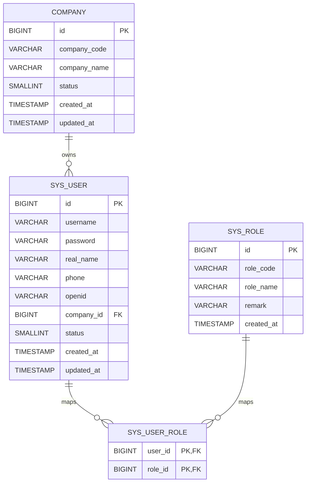

图3-3反映出，company与sys_user之间是一对多关系，而sys_user与sys_role之间通过sys_user_role建立多对多映射。这种设计既支撑了后台管理角色控制，也为小程序用户身份统一管理提供了基础。

### 3.4.2 企业档案类数据表E-R图

企业档案类数据表构成了农产品追溯主线中的主体部分，描述了企业、基地、批次和单品之间的层级关系。该部分体现出明显的主从结构，即企业是最上层业务主体，基地依附于企业存在，批次依附于基地和企业存在，而单品则进一步依附于批次存在。

图3-4 企业档案类数据表E-R图

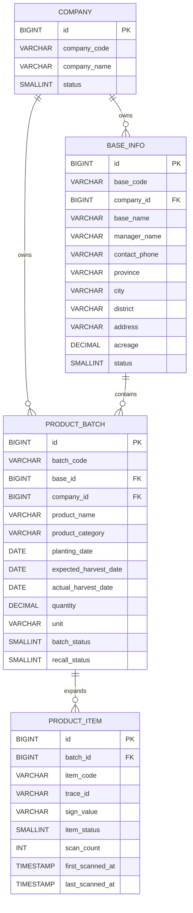

图3-4清晰体现了“企业—基地—批次—单品”的逐层映射关系。该结构是本系统能够实现从生产主体到具体追溯对象完整关联的关键。

### 3.4.3 过程追溯类数据表E-R图

过程追溯类数据表围绕批次和单品记录其在生产、检测和流通过程中的关键事实，是消费者扫码后能够看到详细追溯内容的主要数据来源。与企业档案类不同，这类表更多是对主线对象的补充记录，因此以一对多挂接关系为主。

图3-5 过程追溯类数据表E-R图

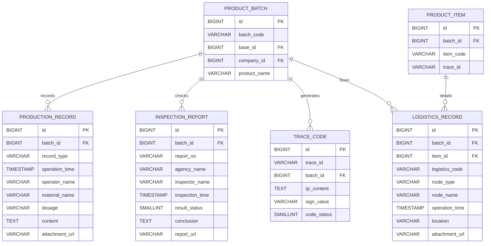

图3-5表明，批次是过程追溯信息的组织中心。生产记录、检验报告和批次级溯源码均直接依附于批次，而物流记录既可挂接批次，也可进一步挂接单品，从而兼顾批次追踪与单品追踪两种粒度。

### 3.4.4 风险协同类数据表E-R图

风险协同类数据表主要服务于异常识别、问题回流和任务闭环处理。与前两类表不同，这类表既与追溯主线存在联系，也与用户、任务和召回记录形成交叉引用，因此关系结构相对更复杂。

图3-6 风险协同类数据表E-R图

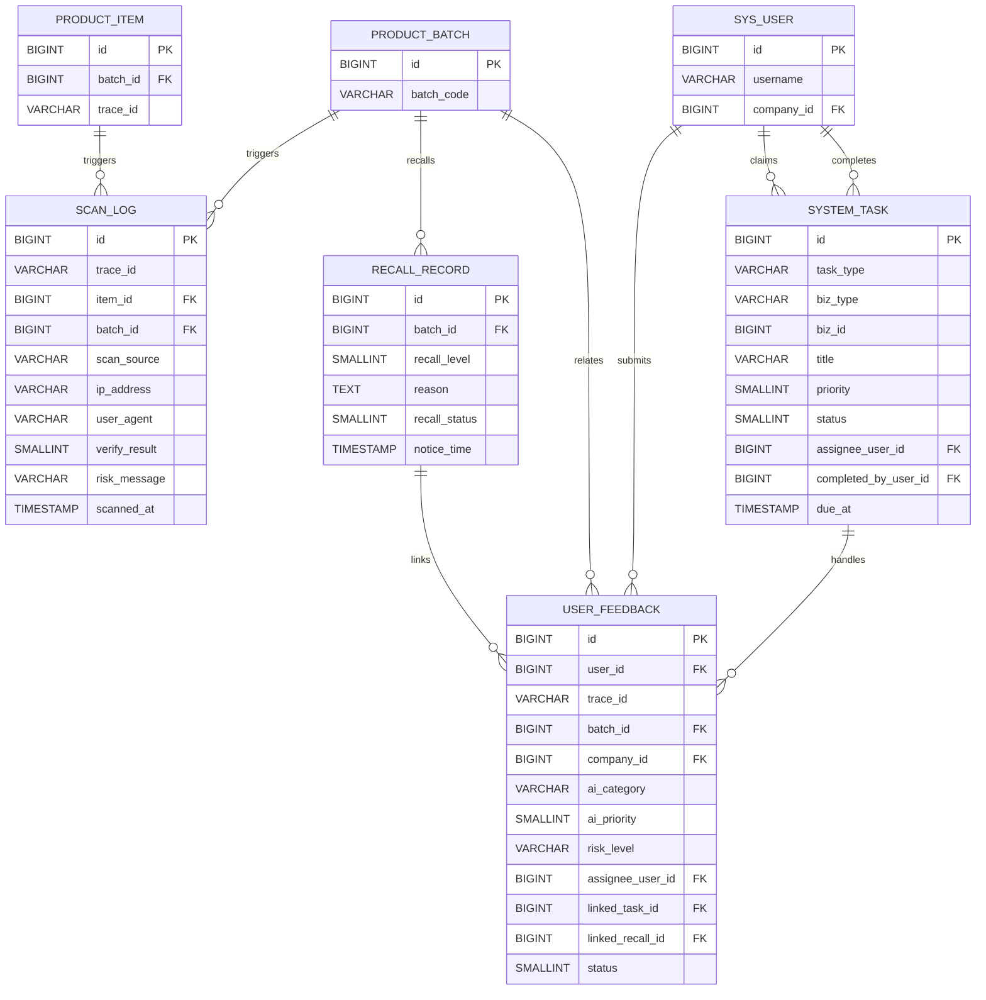

图3-6说明，风险协同类数据并非独立存在，而是附着在追溯主线之上并向管理协同侧延伸。扫码日志面向风险识别，反馈记录面向问题回流，任务记录面向闭环治理，三者共同构成系统的风险协同链路。

### 3.4.5 系统总体数据表E-R图

在上述分类图基础上，可以进一步将主要实体汇总为系统总体E-R图，以体现整个平台在“用户、企业、批次、过程记录、风险任务”之间的完整关联。实际论文排版时，建议将此图作为本节的最终总图，用于统一概括数据库整体结构。

图3-7 系统总体数据表E-R图

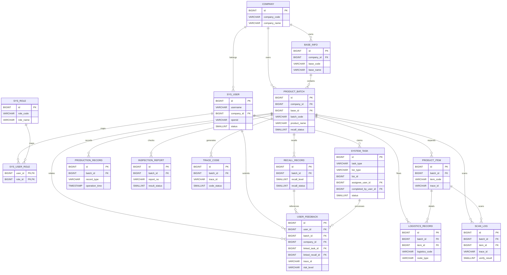

图3-7从整体上反映了本系统数据库采用的“企业主体、追溯主线、过程记录、风险闭环”四层组织思路。企业、用户和角色构成平台身份基础；基地、批次和单品构成追溯主线；生产、检验、物流和溯源码构成过程数据；扫描、召回、反馈和任务构成风险闭环。这一结构既保证了业务主线清晰，又为后续扩展新的统计分析和协同治理能力预留了空间。

### 3.4.6 主要数据表结构设计

为了使数据库设计部分更加完整，下面进一步对系统中的主要业务表进行结构化说明。考虑到论文篇幅和可读性，本文重点列出各表中对业务关系和系统实现影响较大的核心字段。正式排版时可将以下内容整理为连续表格，便于答辩和查阅。

表3-2 `company` 企业信息表

| 字段名 | 类型 | 键 | 说明 |
| --- | --- | --- | --- |
| id | BIGSERIAL | PK | 企业主键 |
| company_code | VARCHAR(64) | UK | 企业编码 |
| company_name | VARCHAR(128) |  | 企业名称 |
| status | SMALLINT |  | 企业状态，1表示启用 |
| created_at | TIMESTAMP |  | 创建时间 |
| updated_at | TIMESTAMP |  | 更新时间 |

表3-3 `sys_user` 系统用户表

| 字段名 | 类型 | 键 | 说明 |
| --- | --- | --- | --- |
| id | BIGSERIAL | PK | 用户主键 |
| username | VARCHAR(64) | UK | 用户名 |
| password | VARCHAR(255) |  | 加密后的密码 |
| real_name | VARCHAR(64) |  | 真实姓名 |
| phone | VARCHAR(20) |  | 联系电话 |
| openid | VARCHAR(128) | UK | 微信登录标识 |
| company_id | BIGINT | FK | 所属企业 |
| status | SMALLINT |  | 用户状态 |
| created_at | TIMESTAMP |  | 创建时间 |
| updated_at | TIMESTAMP |  | 更新时间 |

表3-4 `sys_role` 角色表

| 字段名 | 类型 | 键 | 说明 |
| --- | --- | --- | --- |
| id | BIGSERIAL | PK | 角色主键 |
| role_code | VARCHAR(64) | UK | 角色编码，如ADMIN、OPERATOR、USER |
| role_name | VARCHAR(64) |  | 角色名称 |
| remark | VARCHAR(255) |  | 角色说明 |
| created_at | TIMESTAMP |  | 创建时间 |

表3-5 `sys_user_role` 用户角色关联表

| 字段名 | 类型 | 键 | 说明 |
| --- | --- | --- | --- |
| user_id | BIGINT | PK, FK | 用户ID |
| role_id | BIGINT | PK, FK | 角色ID |

表3-6 `base_info` 基地信息表

| 字段名 | 类型 | 键 | 说明 |
| --- | --- | --- | --- |
| id | BIGSERIAL | PK | 基地主键 |
| base_code | VARCHAR(64) | UK | 基地编码 |
| company_id | BIGINT | FK | 所属企业 |
| base_name | VARCHAR(128) |  | 基地名称 |
| manager_name | VARCHAR(64) |  | 负责人姓名 |
| contact_phone | VARCHAR(20) |  | 联系电话 |
| province | VARCHAR(32) |  | 省份 |
| city | VARCHAR(32) |  | 城市 |
| district | VARCHAR(32) |  | 区县 |
| address | VARCHAR(255) |  | 详细地址 |
| acreage | DECIMAL(10,2) |  | 面积 |
| status | SMALLINT |  | 基地状态 |
| created_at | TIMESTAMP |  | 创建时间 |
| updated_at | TIMESTAMP |  | 更新时间 |

表3-7 `product_batch` 产品批次表

| 字段名 | 类型 | 键 | 说明 |
| --- | --- | --- | --- |
| id | BIGSERIAL | PK | 批次主键 |
| batch_code | VARCHAR(64) | UK | 批次编码 |
| base_id | BIGINT | FK | 所属基地 |
| company_id | BIGINT | FK | 所属企业 |
| product_name | VARCHAR(128) |  | 产品名称 |
| product_category | VARCHAR(64) |  | 产品类别 |
| planting_date | DATE |  | 种植日期 |
| expected_harvest_date | DATE |  | 预计采收日期 |
| actual_harvest_date | DATE |  | 实际采收日期 |
| quantity | DECIMAL(12,2) |  | 产量 |
| unit | VARCHAR(16) |  | 计量单位 |
| batch_status | SMALLINT |  | 批次状态 |
| recall_status | SMALLINT |  | 召回状态 |
| remark | VARCHAR(255) |  | 备注 |
| created_at | TIMESTAMP |  | 创建时间 |
| updated_at | TIMESTAMP |  | 更新时间 |

表3-8 `product_item` 单品信息表

| 字段名 | 类型 | 键 | 说明 |
| --- | --- | --- | --- |
| id | BIGSERIAL | PK | 单品主键 |
| batch_id | BIGINT | FK | 所属批次 |
| item_code | VARCHAR(96) | UK | 单品编码 |
| trace_id | VARCHAR(64) | UK | 单品追溯标识 |
| qr_content | TEXT |  | 二维码内容 |
| sign_value | VARCHAR(255) |  | 签名值 |
| item_status | SMALLINT |  | 单品状态 |
| scan_count | INTEGER |  | 扫码次数 |
| first_scanned_at | TIMESTAMP |  | 首次扫码时间 |
| last_scanned_at | TIMESTAMP |  | 最后扫码时间 |
| generated_at | TIMESTAMP |  | 生成时间 |
| updated_at | TIMESTAMP |  | 更新时间 |

表3-9 `production_record` 生产记录表

| 字段名 | 类型 | 键 | 说明 |
| --- | --- | --- | --- |
| id | BIGSERIAL | PK | 生产记录主键 |
| batch_id | BIGINT | FK | 所属批次 |
| record_type | VARCHAR(32) |  | 记录类型，如施肥、灌溉、采收 |
| operation_time | TIMESTAMP |  | 操作时间 |
| operator_name | VARCHAR(64) |  | 操作人 |
| material_name | VARCHAR(128) |  | 投入品名称 |
| dosage | VARCHAR(64) |  | 用量 |
| content | TEXT |  | 详细记录内容 |
| attachment_url | VARCHAR(255) |  | 附件地址 |
| created_at | TIMESTAMP |  | 创建时间 |

表3-10 `inspection_report` 检验报告表

| 字段名 | 类型 | 键 | 说明 |
| --- | --- | --- | --- |
| id | BIGSERIAL | PK | 报告主键 |
| batch_id | BIGINT | FK | 所属批次 |
| report_no | VARCHAR(64) | UK | 报告编号 |
| agency_name | VARCHAR(128) |  | 检测机构名称 |
| inspector_name | VARCHAR(64) |  | 检测人员 |
| inspection_time | TIMESTAMP |  | 检测时间 |
| result_status | SMALLINT |  | 检测结果状态 |
| conclusion | TEXT |  | 结论说明 |
| report_url | VARCHAR(255) |  | 报告附件地址 |
| created_at | TIMESTAMP |  | 创建时间 |

表3-11 `trace_code` 批次溯源码表

| 字段名 | 类型 | 键 | 说明 |
| --- | --- | --- | --- |
| id | BIGSERIAL | PK | 溯源码主键 |
| trace_id | VARCHAR(64) | UK | 追溯标识 |
| batch_id | BIGINT | FK | 所属批次 |
| qr_content | TEXT |  | 二维码内容 |
| sign_value | VARCHAR(255) |  | 签名值 |
| code_status | SMALLINT |  | 溯源码状态 |
| generated_at | TIMESTAMP |  | 生成时间 |

表3-12 `logistics_record` 物流记录表

| 字段名 | 类型 | 键 | 说明 |
| --- | --- | --- | --- |
| id | BIGSERIAL | PK | 物流记录主键 |
| batch_id | BIGINT | FK | 所属批次 |
| item_id | BIGINT | FK | 所属单品，可为空 |
| logistics_code | VARCHAR(64) |  | 物流单号或物流编码 |
| node_type | VARCHAR(32) |  | 节点类型 |
| node_name | VARCHAR(64) |  | 节点名称 |
| operation_time | TIMESTAMP |  | 节点时间 |
| operator_name | VARCHAR(64) |  | 操作人 |
| contact_phone | VARCHAR(20) |  | 联系电话 |
| location | VARCHAR(255) |  | 节点位置 |
| temperature | VARCHAR(32) |  | 温度 |
| humidity | VARCHAR(32) |  | 湿度 |
| attachment_url | VARCHAR(255) |  | 附件地址 |
| remark | VARCHAR(255) |  | 备注 |
| created_at | TIMESTAMP |  | 创建时间 |

表3-13 `recall_record` 召回记录表

| 字段名 | 类型 | 键 | 说明 |
| --- | --- | --- | --- |
| id | BIGSERIAL | PK | 召回主键 |
| batch_id | BIGINT | FK | 所属批次 |
| recall_level | SMALLINT |  | 召回等级 |
| reason | TEXT |  | 召回原因 |
| recall_status | SMALLINT |  | 召回状态 |
| notice_time | TIMESTAMP |  | 通知时间 |
| closed_at | TIMESTAMP |  | 关闭时间 |
| created_at | TIMESTAMP |  | 创建时间 |

表3-14 `scan_log` 扫码日志表

| 字段名 | 类型 | 键 | 说明 |
| --- | --- | --- | --- |
| id | BIGSERIAL | PK | 扫码日志主键 |
| trace_id | VARCHAR(64) |  | 追溯标识 |
| item_id | BIGINT | FK | 单品ID |
| batch_id | BIGINT | FK | 批次ID |
| scan_source | VARCHAR(32) |  | 扫码来源 |
| ip_address | VARCHAR(64) |  | IP地址 |
| user_agent | VARCHAR(255) |  | 终端标识 |
| verify_result | SMALLINT |  | 校验结果 |
| risk_message | VARCHAR(255) |  | 风险提示信息 |
| scanned_at | TIMESTAMP |  | 扫码时间 |

表3-15 `user_feedback` 用户反馈表

| 字段名 | 类型 | 键 | 说明 |
| --- | --- | --- | --- |
| id | BIGSERIAL | PK | 反馈主键 |
| user_id | BIGINT | FK | 提交用户ID |
| type | VARCHAR(64) |  | 反馈类型 |
| content | TEXT |  | 反馈内容 |
| contact | VARCHAR(128) |  | 联系方式 |
| trace_id | VARCHAR(64) |  | 关联追溯码 |
| batch_id | BIGINT | FK | 关联批次 |
| company_id | BIGINT | FK | 关联企业 |
| ai_category | VARCHAR(32) |  | AI分类结果 |
| ai_priority | SMALLINT |  | AI优先级 |
| risk_level | VARCHAR(16) |  | 风险等级 |
| urgent_flag | SMALLINT |  | 紧急标记 |
| ai_summary | VARCHAR(255) |  | AI摘要 |
| assignee_user_id | BIGINT | FK | 指派处理人 |
| linked_task_id | BIGINT | FK | 关联任务ID |
| linked_recall_id | BIGINT | FK | 关联召回ID |
| handle_note | VARCHAR(255) |  | 处理说明 |
| status | SMALLINT |  | 处理状态 |
| created_at | TIMESTAMP |  | 创建时间 |
| handled_at | TIMESTAMP |  | 处理时间 |
| updated_at | TIMESTAMP |  | 更新时间 |

表3-16 `system_task` 系统任务表

| 字段名 | 类型 | 键 | 说明 |
| --- | --- | --- | --- |
| id | BIGSERIAL | PK | 任务主键 |
| task_type | VARCHAR(64) |  | 任务类型 |
| biz_type | VARCHAR(32) |  | 业务对象类型 |
| biz_id | BIGINT |  | 业务对象ID |
| title | VARCHAR(128) |  | 任务标题 |
| description | VARCHAR(255) |  | 任务描述 |
| priority | SMALLINT |  | 优先级 |
| status | SMALLINT |  | 任务状态 |
| assignee_user_id | BIGINT | FK | 认领人 |
| claimed_at | TIMESTAMP |  | 认领时间 |
| completed_by_user_id | BIGINT | FK | 完成人 |
| source_type | VARCHAR(32) |  | 任务来源类型 |
| due_at | TIMESTAMP |  | 截止时间 |
| completed_at | TIMESTAMP |  | 完成时间 |
| created_at | TIMESTAMP |  | 创建时间 |
| updated_at | TIMESTAMP |  | 更新时间 |

从上述表结构可以看出，系统数据库既保留了追溯业务主线所需的主体表和过程表，也通过扫码日志、反馈表和任务表实现了风险闭环管理。若从论文表达上进行概括，可以认为：`company`、`base_info`、`product_batch` 和 `product_item` 构成主线实体；`production_record`、`inspection_report`、`logistics_record` 和 `trace_code` 构成过程记录实体；`scan_log`、`recall_record`、`user_feedback` 和 `system_task` 构成风险协同实体；而 `sys_user`、`sys_role` 和 `sys_user_role` 构成统一身份与权限基础。

### 3.4.7 可直接导入 draw.io 的绘图代码

为了方便后续正式制图，下面给出可直接复制到 draw.io（diagrams.net）中的 Mermaid 代码。使用方式为：打开 draw.io，选择“插入”->“高级”->“Mermaid”，然后将对应代码粘贴进去即可自动生成图形。若后续需要调整字体、颜色、线条和布局，可在导入后继续手动微调。

（1）用户权限类数据表E-R图代码

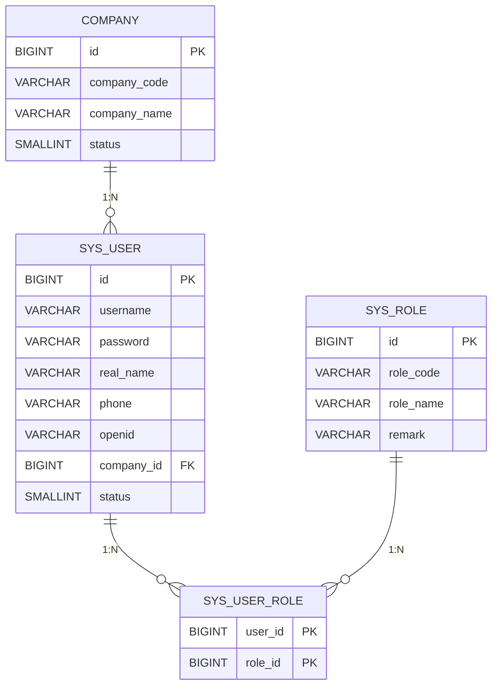

（2）企业档案类数据表E-R图代码

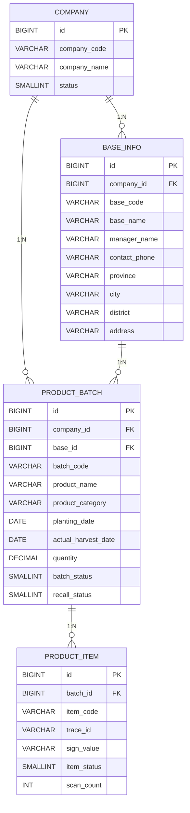

（3）过程追溯类数据表E-R图代码

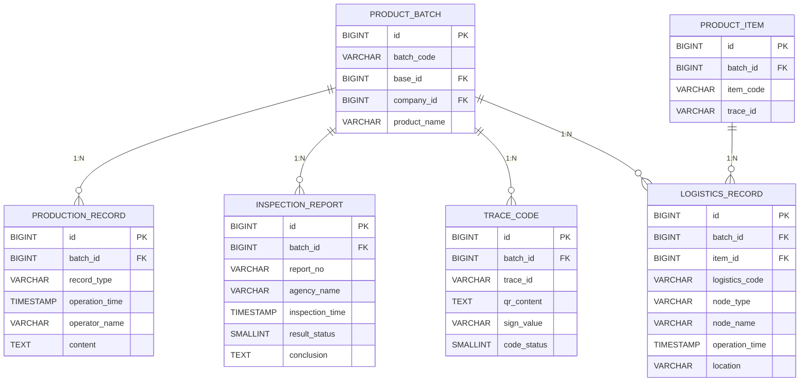

（4）风险协同类数据表E-R图代码

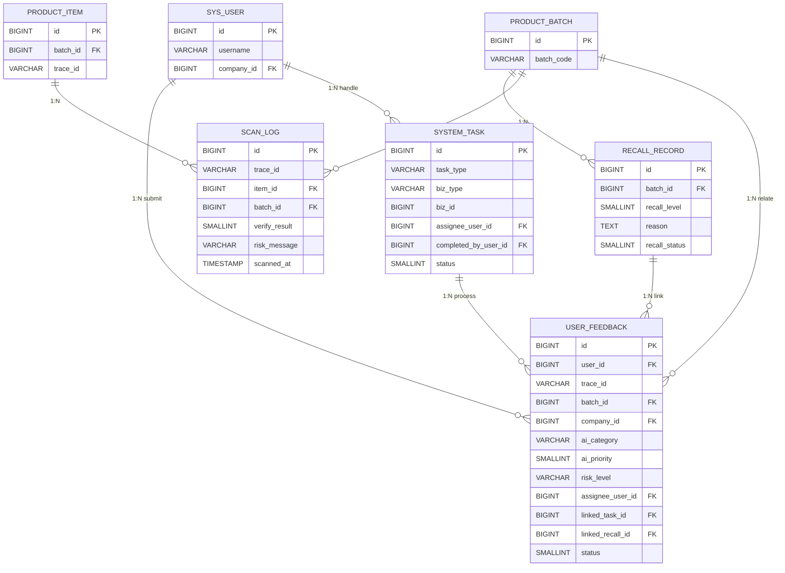

（5）系统总体数据表E-R图代码

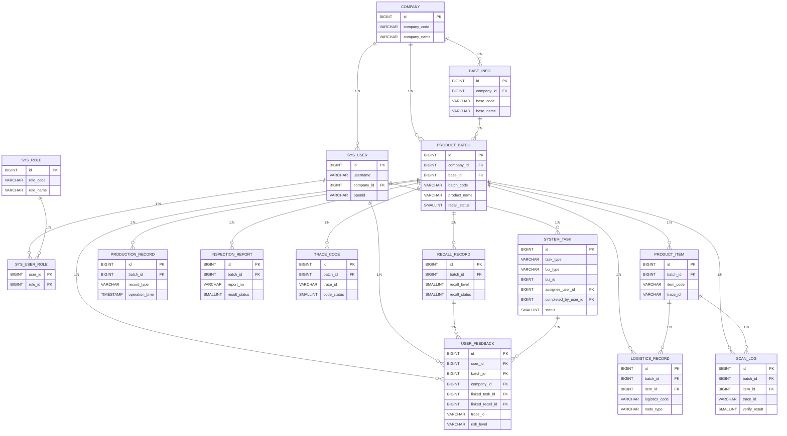

（6）系统数据库主从层级关系流程图代码

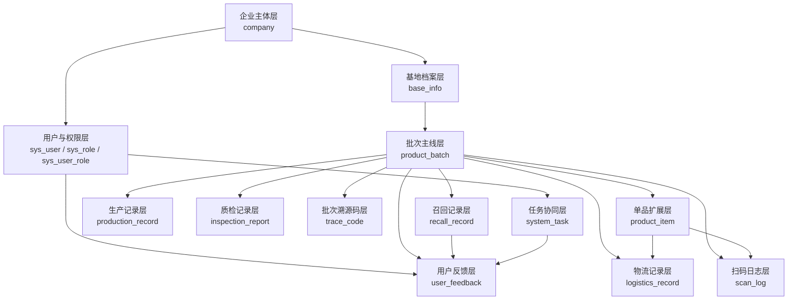

上述代码中，E-R图适合用于数据库设计章节中的实体关系展示，总体层级流程图则更适合用于说明“系统数据库的组织层次”和“主线数据如何向风险闭环延伸”。如果论文版面允许，建议在3.4节中保留图3-7作为总E-R图，并将图3-3至图3-6拆分放入附图或附录中，这样主次更清晰。

## 3.5 实现系统的关键技术

本系统能够完成多端协同的农产品溯源业务，离不开若干关键技术的组合应用。首先，在Web管理端方面，系统采用Vue 3与TypeScript构建单页应用，并结合Vue Router完成页面组织与导航守卫。组件库使用Element Plus，以较低成本实现表单录入、分页查询、对话框、统计卡片、时间线和表格管理等后台界面功能。该技术组合开发效率较高，适合承载毕业设计中结构较复杂、数据录入较频繁的管理业务场景。

其次，在微信小程序端方面，系统采用原生小程序页面体系组织查询、收藏、反馈、个人中心和报告预览等功能。相较于传统H5页面，小程序在扫码入口、登录授权、页面切换和本地存储方面具有天然优势，更贴合“消费者即扫即查”的使用场景。系统在小程序中对查询历史、收藏记录和个人会话状态进行本地化处理，同时通过后端接口拉取溯源详情、质量解读和物流时间线，实现了轻前端、重服务聚合的设计思路。

再次，在后端实现方面，Spring Boot提供了清晰的工程组织方式与稳定的Web服务能力，MyBatis适合处理本系统中大量以批次、企业、状态、时间为条件的动态查询。由于溯源平台的数据关系较明确，但筛选条件经常随页面而变化，MyBatis在SQL可读性和灵活拼接方面具有明显优势。配合Service层的业务封装，系统可以较清晰地实现批次档案聚合、反馈任务联动、风险统计和扫码校验等逻辑。

在数据库技术方面，openGauss作为关系型数据库承担了核心业务数据存储任务。系统在初始化阶段通过脚本自动创建表结构、索引和部分增量字段，降低了环境部署与版本演进成本。相较于简单文件存储方式，关系型数据库更适合处理本系统中大量稳定的一对多关系和条件检索需求。

在安全控制方面，系统通过Bearer Token机制识别用户身份，并借助拦截器在请求进入业务层之前完成认证校验。与此同时，后端服务广泛引入companyId范围控制，实现同一部署环境下的企业数据隔离。对于公开溯源接口，系统则采用“开放查询 + 签名校验 + 风险提示”的组合方式，在保证消费者可直接扫码访问的同时，尽量减少伪造或篡改链接带来的误导风险。

在智能辅助方面，系统引入了AI问答和反馈智能分类能力。小程序AI问答功能围绕当前溯源详情构造上下文，帮助用户理解检验结果、物流情况和风险提示；Web端的员工AI助手以及反馈AI分类能力，则用于提升反馈分流、风险识别和处理说明整理的效率。虽然该部分能力仍属于规则与模型结合的初步应用，但它体现了本系统从“信息展示型平台”向“智能辅助型平台”的延伸方向。

---

# 第4章 系统详细设计及实现

## 4.1 小程序溯源查询模块的设计及实现

### 4.1.1 小程序溯源查询模块的用户界面设计

小程序端是系统面向消费者的主要展示窗口，因此界面设计首先强调低门槛和直观性。根据当前项目实现情况，小程序采用“查询、收藏、反馈、我的”四栏底部导航结构，其中“查询”页既承担首页输入查询入口，也承担扫码后的默认落地入口。用户进入系统后，可以通过手动输入溯源码或调用微信扫码能力直接进入溯源详情页，这种双入口设计兼顾了线下扫码和手工复查两类使用场景。

溯源详情页是小程序模块的核心页面。该页面围绕“先验真、再概览、后展开”的思路组织内容：页面顶部优先展示验真结果、风险提示和可信度摘要，帮助用户第一时间判断当前商品是否需要警惕；中部依次展示基地信息、批次信息、生产记录、检验报告、物流节点和召回信息；页面中还集成“质量解读”“物流时间线”“AI问答”“加入收藏”等操作入口，使用户可以根据自己的关切继续向下查看。相较于直接平铺数据库字段，这种界面结构更适合非专业用户理解。

在扩展页面设计上，质量解读页专门用于展示TraceSummaryService生成的摘要标题、可信度评分、重点亮点、风险提示和建议动作，把后端规则计算结果转化为更容易理解的解释文本；物流时间线页按照时间顺序组织运输、仓储、中转和签收等节点，强化“过程可视化”体验；AI问答页采用对话式界面，并提供常见问题建议项，降低用户输入成本；报告预览页则负责承载检验报告图片或PDF附件展示。收藏页、历史页和我的反馈页则分别面向持续访问需求、重复查询需求和问题跟踪需求。由此，小程序侧实际上已经形成了较完整的消费者服务闭环。

为了说明小程序端在界面组织上的整体风格和主要页面关系，本文在此处安排首页与详情页示意图。正式论文中可优先选用当前项目运行截图，增强真实性和可读性。

图4-1 小程序首页与溯源详情页示意图  
建议在最终论文中插入首页查询页、扫码进入详情页、质量解读页和物流时间线页的实际截图。

从图4-1可以看出，小程序端采用的是以查询结果为中心的页面组织方式。首页负责快速发起查询，详情页负责集中展示核心追溯信息，而质量解读和物流时间线等页面则承担解释与展开功能，形成由“入口”到“详情”再到“深化理解”的连续体验。

### 4.1.2 小程序溯源查询模块的程序处理流程设计

从程序处理流程看，小程序端查询链路主要分为参数获取、详情拉取、摘要拉取、展示加工和交互扩展五个阶段。首先，在首页或扫码入口处获取traceId及可选的sign参数；其次，详情页加载时并行调用溯源详情接口和溯源摘要接口，其中前者用于获取批次、基地、生产、质检、物流和召回等结构化数据，后者用于获取可信度评分和解释性文本；再次，小程序在前端对返回数据进行二次加工，例如拼接基地完整地址、格式化时间、换算数据完整度、构造详情页小型统计图以及补全报告绝对路径；最后，再根据当前页面状态开放收藏、报告预览、质量解读跳转、物流时间线跳转和AI问答跳转等行为。

当前实现中的处理流程并非简单的数据直出，而是包含了较明显的前端适配逻辑。以溯源详情页为例，页面在拉取数据后会先计算生产记录数、质检报告数、物流节点数和召回预警数等指标，并以可视化方式展示；同时还会依据基地负责人、产品类别、播种时间、实际采收时间、是否存在质检报告、是否存在物流记录和签名是否有效等信息，计算数据完整度百分比。这种处理方式使小程序既能保留原始业务信息，又能向消费者提供更简洁的状态感知。

质量解读、物流时间线和AI问答页面的处理流程也具有一定代表性。质量解读页仅依赖traceId和sign参数即可独立请求摘要数据，因此能够与详情页形成松耦合关系；物流时间线页在请求详情数据后，会对物流记录按operationTime重新排序，并把附件路径转换为可访问地址，以满足时间线展示与附件预览需求；AI问答页则以当前traceId构造上下文标识，在发送用户提问后请求后端AI接口，并将问答历史按traceId和签名组合键写入本地缓存，从而实现按商品维度保留对话记录。整体来看，小程序模块在流程设计上兼顾了接口复用、页面解耦和用户连续使用体验。

为了进一步说明小程序端从输入追溯码到展示结果的内部处理顺序，本文给出小程序溯源查询处理流程图。

图4-2 小程序溯源查询处理流程图  
建议绘制“首页输入或扫码 → 解析traceId/sign → 请求详情与摘要 → 前端加工展示 → 进入质量解读/物流时间线/AI问答/收藏”的流程图。

图4-2表明，小程序端虽然界面轻量，但内部处理并不简单。它既承担参数解析和页面跳转职责，也承担一定的数据格式化与缓存管理职责，因此能够在后端聚合结果基础上进一步提升用户端展示效果。

### 4.1.3 小程序溯源查询模块的程序代码

见“附录 程序源代码”中的小程序溯源查询模块程序代码。论文正文可重点附上首页查询页、溯源详情页、质量解读页、物流时间线页和AI问答页的关键代码片段，并对参数解析、接口调用、状态管理和本地收藏实现进行说明。

## 4.2 Web管理模块的设计及实现

### 4.2.1 Web管理模块的用户界面设计

Web管理端承担企业内部业务录入与治理功能，因此界面设计更强调信息密度、筛选效率和流程化组织。根据当前系统实现，管理端采用统一后台布局，包含左侧菜单、顶部信息区和主体业务内容区。首页仪表盘用于展示基地数量、批次数量、溯源码数量、生产记录数量、质检报告数量和召回数量等总体统计，帮助用户快速了解平台运行状态。相比消费者端偏感知型展示，Web端首页更注重经营概览和管理视角。

在业务页面组织方面，系统已经形成比较清晰的菜单结构，包括任务工作台、风险中心、基地管理、批次管理、批次档案、单品管理、物流管理、生产记录管理、检验报告管理、召回管理、反馈跟踪、用户管理、个人资料、农情快速导入和员工AI助手等页面。其中，基地管理与批次管理页面以表格、筛选和分页为主，适合大量数据维护；批次档案页则围绕单一批次汇总关联记录，适合进行纵向核查；物流、质检和生产记录页面主要承担过程数据录入职责；风险中心与任务工作台则体现平台面向管理协同和风险治理的扩展能力。

以风险中心页面为例，当前实现采用多组KPI卡片加表格明细的组合方式，上方显示开放任务数、高风险批次数、低完整度批次数、异常扫码数、待处理反馈数和高优反馈批次数，中部展示风险来源拆分、异常扫码TOP和低完整度批次列表，下方再展示高风险批次排行表。这种界面设计将“总览、定位、下钻”结合起来，既能满足管理层看整体，也能支持操作人员直接点击进入批次档案处理具体问题。任务工作台页面则通过状态筛选、优先级标签和认领、完成、重开等操作，突出“待办驱动”的处理方式，适合内部协同场景。

为了直观展示管理端的典型页面布局与信息密度，本文在此处安排Web管理端主要页面示意图。

图4-3 Web管理端主要页面示意图  
建议插入仪表盘、风险中心、任务工作台和批次档案页的截图。

从图4-3可以看出，Web管理端更强调表格化、统计化和任务化展示方式。与小程序端偏感知式信息表达不同，后台页面强调的是高效录入、快速筛选和集中治理，符合企业内部管理场景的使用习惯。

### 4.2.2 Web管理模块的程序处理流程设计

Web管理模块的程序处理流程可以概括为“身份校验 - 页面初始化 - 条件查询 - 表单录入或更新 - 联动展示”。用户访问后台页面前，前端路由守卫首先检查本地Token是否存在；若存在但用户信息尚未拉取，则主动请求当前登录用户信息；若身份不属于员工角色，则直接执行登出并返回登录页。该流程保证了后台页面不会被未授权用户直接访问，也是管理端和小程序端共用后端而能保持权限边界的重要原因。

在数据交互上，多数管理页面采用统一的列表查询模式，即页面初始化时按默认条件请求分页数据，用户再通过关键字、状态、所属对象等条件进行筛选。以任务工作台为例，页面加载后请求任务分页接口，表格中展示任务标题、描述、优先级、状态、认领人、完成人和截止时间等字段；当用户点击认领、完成或重新打开按钮时，前端调用相应接口更新任务状态，随后刷新列表，从而形成明确的状态流转过程。风险中心页面则在初始化时拉取汇总对象，并通过本地映射方法把风险等级转换为可视化标签，提升界面可读性。

对于档案管理类页面，程序流程更强调主从关联。用户先在基地管理中维护生产主体，再在批次管理中为批次绑定企业和基地信息，之后围绕批次持续补充生产记录、质检报告、物流节点和单品信息。批次档案页则相当于这一链路的聚合观察窗口，通过一次访问查看某批次在多个业务表中的关联结果。这样的程序流程与数据库设计保持一致，有利于减少孤立数据和无归属记录出现的概率。

为了梳理管理端从登录到业务维护再到风险处理的主流程，本文给出Web管理端业务处理流程图。

图4-4 Web管理端业务处理流程图  
建议绘制“登录 → 进入管理后台 → 维护基地和批次 → 补充生产、质检、物流数据 → 生成溯源码 → 风险监控与任务处理”的流程图。

图4-4说明，Web管理端并不是若干孤立页面的简单拼接，而是围绕批次主线形成了连续业务流。其前半段以数据生产为主，后半段以风险治理和问题处理为主，两者共同构成系统的企业端闭环。

### 4.2.3 Web管理模块的程序代码

见“附录 程序源代码”中的Web管理模块程序代码。论文正文建议选取仪表盘统计、风险中心汇总接口调用、任务工作台状态流转以及批次档案聚合展示等关键部分进行说明，以体现系统从基础录入到管理协同的完整实现能力。

## 4.3 风险协同与智能服务模块的设计及实现

### 4.3.1 风险协同与智能服务模块的用户界面设计

风险协同与智能服务模块是本系统区别于传统静态溯源展示系统的重要部分。从界面表现上，该模块横跨Web端与小程序端。Web端主要通过风险中心、任务工作台、反馈跟踪和员工AI助手体现；小程序端则通过质量解读、AI问答、我的反馈和收藏、历史等功能体现。两类终端虽然服务对象不同，但都围绕“帮助用户更快理解问题并推动后续处理”这一目标展开。

在Web端，风险中心界面更偏向管理驾驶舱风格，突出风险总量、来源拆分和高风险对象排行；任务工作台突出任务生命周期管理；反馈跟踪页面用于查看用户反馈的内容、风险等级、优先级、处理状态和处理人员；员工AI助手则更像辅助办公入口，帮助工作人员围绕当前业务上下文整理问题。小程序侧的质量解读页和AI问答页则将风险与质量信息以解释型文本呈现，避免消费者只能看到原始记录却不理解其含义。这种“管理侧重决策，消费侧重解释”的界面分工较符合实际场景。

为了对比展示风险治理能力在两类终端上的不同落点，本文在此处安排风险协同与智能服务界面示意图。

图4-5 风险协同与智能服务界面示意图  
建议插入风险中心、任务工作台、反馈跟踪、小程序质量解读页和AI问答页的截图。

从图4-5可以看出，风险协同与智能服务模块同时面向管理端与消费者端发挥作用。管理端偏向“识别和处理”，消费者端偏向“解释和感知”，两者共同提升了系统在真实场景中的实用性。

### 4.3.2 风险协同与智能服务模块的程序处理流程设计

该模块的程序处理流程以“识别风险、沉淀问题、形成任务、辅助解释”为主线。首先，后端会在批次档案完整度不足、缺少检验报告、缺少物流记录、出现异常扫码或产生高风险反馈时生成或更新相关风险信息，并将统计结果提供给风险中心页面展示。其次，系统通过system_task表保存自动生成或人工处理的待办任务，工作人员在任务工作台中认领后可进入处理中状态，完成后再更新为已完成，从而实现问题闭环。

在用户反馈链路中，小程序用户提交反馈时，系统会把反馈与traceId、batchId、companyId等业务标识关联存储，并结合AI分类结果、优先级和风险等级字段提供后续处理依据。Web端反馈跟踪页面再基于这些字段进行筛选、分派和处理说明填写，使一条来自消费者端的问题能够回流到企业内部处理链路中。可以看到，本系统中的反馈并不是孤立留言，而是参与风险协同机制的一部分。

在智能服务流程方面，小程序AI问答页会将用户问题和traceId提交给后端，由后端基于当前公开溯源信息构造回答上下文，再把答案和参考信息返回前端；前端则把最近若干轮问答记录保存在本地，供用户重复查看。质量解读功能则由后端TraceSummaryService基于规则评分生成摘要文本、亮点、风险提示和建议动作，再由前端单独页面展示。Web端员工AI助手与反馈AI分类能力则服务于内部处理效率提升。总体而言，智能服务模块并未脱离原有业务数据单独运行，而是建立在追溯详情、反馈内容和风险状态之上，属于业务增强型能力。

为了进一步说明风险事件和反馈信息如何在系统内部流转，本文给出风险协同与智能服务处理流程图。

图4-6 风险协同与智能服务处理流程图  
建议绘制“扫码或反馈触发 → 风险识别 → 风险中心汇总 → 任务工作台流转 → AI解释或辅助处理 → 闭环归档”的流程图。

图4-6表明，风险协同与智能服务模块并不是附加在系统之外的独立能力，而是深度嵌入到追溯查询、反馈回流和任务处理链路中的增强能力。通过这一模块，系统实现了从“记录业务”向“辅助治理”延伸。

### 4.3.3 风险协同与智能服务模块的程序代码

见“附录 程序源代码”中的风险协同与智能服务模块程序代码。正文可选取风险中心汇总逻辑、任务工作台状态变更逻辑、反馈分类与分派逻辑，以及TraceSummaryService中的可信度评分与质量解读生成逻辑作为代表性代码。

---

# 第5章 系统测试及使用说明

## 5.1 系统测试报告

### 5.1.1 测试的目的及原则

系统测试的主要目的是验证当前实现的农产品溯源平台是否能够在真实业务流程下稳定运行，并确认小程序端、Web端、后端接口与数据库之间的数据交互是否正确。由于本系统既包含公开查询场景，也包含后台管理与风险协同场景，因此测试不仅要关注单一页面是否能打开，还要重点验证关键链路是否闭环，例如批次建档后是否能正确生成查询对象、扫码后是否能正确返回溯源详情、用户反馈后是否能回流到管理端，以及任务状态是否能够正常流转。

在测试原则上，本文遵循功能正确性优先、关键流程优先、前后端联动验证和用户视角验证相结合的思路。对于管理端，重点关注数据录入、修改、筛选和聚合展示是否准确；对于小程序端，重点关注查询便捷性、结果完整性和错误提示清晰性；对于后端和数据库，重点关注权限控制、企业范围隔离、数据一致性和异常情况下的响应行为。通过这些原则，能够较全面地判断系统是否达到毕业设计要求。

### 5.1.2 测试过程及结果

（1）账号登录与权限控制测试  
测试过程中分别使用管理员账号、企业员工账号和小程序普通用户账号进行访问验证。结果表明，Web管理端在无Token或Token失效时会自动跳转登录页；已登录但不具备员工身份的用户无法进入后台菜单；管理员和员工可正常访问各自授权页面。该结果说明系统的Token认证、路由守卫和角色隔离机制能够正常工作。

（2）批次档案与过程记录管理测试  
在Web端依次完成基地创建、批次创建、生产记录录入、检验报告上传和物流节点维护，并在批次档案页查看聚合结果。测试结果显示，各类记录能够正确与目标批次关联，档案页可以集中展示生产、质检、物流、召回和扫码统计等信息，说明系统具备较好的主数据与过程数据关联能力。

（3）溯源码查询与扫码验证测试  
通过批次级和单品级溯源码分别进行查询，验证traceId解析、签名校验、详情聚合和异常提示逻辑。测试结果表明，正常签名可返回完整溯源详情，签名异常时系统能够给出校验失败提示，召回批次能够显示风险警告，重复扫码时能够累积扫描次数并记录扫码日志，说明核心追溯查询链路运行正常。

（4）质量解读、物流时间线与报告预览测试  
在小程序端打开质量解读页、物流时间线页和报告预览页，验证摘要生成、节点排序和附件访问能力。测试结果表明，质量解读页可以正确展示可信度、风险提示和建议动作；物流时间线可以按时间组织物流节点；检验报告及相关附件能够在预览页正常打开。该结果说明系统已不局限于原始数据展示，而具备较好的解释性和可视化能力。

（5）用户反馈与任务协同测试  
在小程序端提交带有traceId和批次关联的反馈信息，再在Web端查看反馈跟踪和任务工作台。测试结果显示，反馈记录能够正确进入后台列表，并携带优先级、风险等级和处理状态等信息；任务工作台可以完成认领、完成和重新打开等操作。该结果说明系统已经形成消费者问题回流到企业内部处理的协同链路。

（6）风险中心与统计展示测试  
对存在异常扫码、低完整度批次和待处理反馈的数据进行验证，检查风险中心页面的KPI统计、风险来源拆分和高风险排行是否正确。测试结果显示，系统可以正常汇总开放任务数、异常扫码数、待处理反馈数以及高风险批次排行，并支持跳转到具体批次档案查看详情，说明风险总览和下钻联动能力符合预期。

### 5.1.3 测试总结

综合测试结果可以看出，当前系统已经较完整地实现了农产品溯源平台的核心功能，尤其在“后台建档 - 小程序查询 - 反馈回流 - 风险协同”这一闭环上表现较为稳定。系统在实际测试中能够完成账号权限控制、批次档案聚合、扫码查询、质量解读、物流展示、反馈处理和任务流转等关键功能。与此同时，也应看到系统仍存在继续优化空间，例如更大规模数据下的性能压测、更多异常场景下的鲁棒性测试以及AI回答质量的持续评估等，可作为后续完善方向。

## 5.2 系统使用说明

### 5.2.1 系统简介

本系统是一个基于微信小程序与Web管理端协同运行的农产品溯源平台。普通消费者可使用小程序完成扫码查询、质量解读、物流查看、AI问答、收藏和反馈提交；企业员工和管理员可在Web端完成基地、批次、生产记录、检验报告、物流记录、召回信息、反馈任务和风险数据的维护与处理。系统以后端统一接口和openGauss数据库为支撑，实现了追溯信息的集中管理和多端展示。

### 5.2.2 系统运行环境

系统运行环境主要包括以下几个部分：前端Web管理端运行于Node.js支持的构建环境中，浏览器建议使用Chrome等现代浏览器；微信小程序端运行于微信开发者工具或实际微信客户端环境中；后端服务运行于JDK支持的Spring Boot环境中；数据库采用openGauss。开发调试阶段可在本地或局域网环境部署，生产化部署时可将Web端、小程序请求域名、后端服务和数据库分别部署到独立服务器或容器环境中。

### 5.2.3 系统操作说明

对于Web管理端，用户首先访问登录页并输入账号密码完成登录；登录成功后可进入仪表盘查看总体统计。若需要维护追溯数据，可按照“基地管理 - 批次管理 - 生产记录/检验报告/物流记录 - 单品或溯源码生成 - 批次档案核查”的顺序进行操作；若需要处理异常与风险，可进入风险中心查看概览，再到任务工作台和反馈跟踪页面进行认领、处理和关闭。

对于微信小程序端，用户可在首页直接输入溯源码，或通过扫码进入溯源详情页。进入详情后，可查看验真结果、基地与批次信息、生产过程、质检报告、物流记录和召回提示；若需要进一步理解信息，可点击质量解读、物流时间线和AI问答入口；若需要后续继续查看，可将当前商品加入收藏或在历史记录中再次打开；若发现问题，可在反馈页提交意见，并在“我的反馈”中查看处理进度。

---

# 设计总结

本文围绕当前已经实现的农产品溯源系统，对系统的研究背景、需求分析、总体设计、详细实现、测试过程和使用方式进行了系统整理。与单纯展示概念性方案不同，本文所描述的内容均以现有项目实际能力为基础，覆盖了Web管理端、微信小程序端、Spring Boot后端和openGauss数据库之间的协同关系，也反映了系统已经完成的批次建档、单品追溯、质量解读、物流时间线、反馈回流、任务协同和风险中心等核心功能。

从项目实现效果来看，本系统较好地满足了农产品追溯场景中“企业可管理、消费者可查询、问题可回流、风险可协同”的基本目标。Web端完成了从基础档案到风险治理的业务支撑，小程序端完成了从扫码查询到解释性展示的用户服务，后端则承担了统一聚合、校验、记录与权限控制职责。尤其是质量解读、物流时间线、AI问答、反馈任务联动等能力的加入，使系统不再停留在传统的静态追溯页面层面，而开始具备一定的解释、预警和协同处理能力。

当然，系统仍有继续完善空间。例如，后续可以进一步优化高并发场景下的性能表现，完善更多异常校验策略，增强图表分析能力，提升AI回答的稳定性与可控性，并在论文终稿中补充更规范的体系结构图、流程图、数据库E-R图和关键页面截图。总体而言，本课题完成了一套具有真实业务逻辑和可运行成果的农产品溯源平台，对毕业设计实践和后续功能深化都具有较好的基础价值。

# 参考文献

[1] 王晓东. 算法设计与分析（第4版）[M]. 北京: 清华大学出版社, 2018.  
[2] 张秋余, 张聚礼, 柯铭, 等. 软件工程[M]. 西安: 西安电子科技大学出版社, 2014.  
[3] 萨师煊, 王珊. 数据库系统概论（第5版）[M]. 北京: 高等教育出版社, 2014.  
[4] 陈刚. Spring Boot企业级应用开发实战[M]. 北京: 机械工业出版社, 2022.  
[5] 周志明. 深入理解Java虚拟机（第3版）[M]. 北京: 机械工业出版社, 2019.  
[6] 杨树林, 马会杰. 农产品质量安全追溯体系建设研究[J]. 农业经济问题, 2021(8): 112-118.  
[7] 李强, 王雪. 基于二维码的农产品溯源系统设计与实现[J]. 计算机工程与应用, 2022, 58(14): 215-221.  
[8] 徐敏, 赵鹏. 面向食品安全的供应链追溯信息平台研究[J]. 情报科学, 2020, 38(9): 141-147.  
[9] Nivaashini M, Suganya E, Sountharrajan S, et al. FEDDBN-IDS: federated deep belief network-based wireless network intrusion detection system[J]. Eurasip Journal on Information Security, 2024, 2024(1): 8.  
[10] Alsadhan A A, Roken N A, Ansari S, et al. Kernel-based machine learning intrusion detection systems for ICMPv6 DDoS detection[J]. Results in Engineering, 2025, 28: 106940.

# 外文翻译

## 原文

此处可放置与农产品追溯、食品安全数字化管理或供应链透明化相关的外文文献原文。正式提交时建议选择一篇与追溯系统设计、食品安全信息化或农业供应链数字化相关的英文论文，并按照学校要求控制篇幅。

## 译文

此处可放置对应外文文献的中文翻译内容。建议在正式排版时保持术语统一，特别是对traceability、supply chain、inspection report、risk warning等专业词汇采用全文一致的译法。

# 附录  程序源代码

## A模块的程序代码

建议放置小程序溯源查询模块关键代码，如首页查询逻辑、溯源详情页、质量解读页、物流时间线页和AI问答页代码。

## B模块的程序代码

建议放置Web管理模块关键代码，如路由守卫、风险中心页面、任务工作台页面、批次档案页和相关接口调用代码。

## C模块的程序代码

建议放置后端核心代码，如TraceCodeService、TraceSummaryService、TraceSecurityService、ScanLogService以及关键Mapper或数据库表结构代码。

# 致  谢

在本次毕业设计与论文撰写过程中，得到了指导教师、同学和家人的帮助与支持。在课题选题、系统实现、问题分析和论文修改过程中，指导教师给予了耐心指导和宝贵建议，使我能够逐步完成从需求分析、系统开发到论文整理的全过程。在此表示衷心感谢。

同时，也感谢项目开发过程中提供帮助的同学与朋友，他们在系统调试、功能体验和问题交流方面给予了很多启发。最后，感谢家人在整个学习和毕业设计阶段给予的理解与支持，使我能够较为顺利地完成本次课题。
